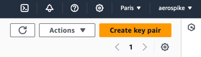
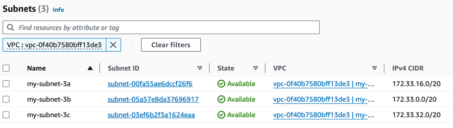

Here's the rewritten section of your blog using markup:

# VPC Peering, Split Brain with Distributed Cross Region NoSQL-DB

## What the Heck!

In this article, we are going to create a well-known split brain problem. This is where we create a network separation within a single, distributed system to observe the effects.

### Steps Overview

1. **Create 2 Unrelated VPCs in AWS:** Each VPC will be in a different region.
2. **Run a Simple 2-Way Chat Message Across the Private Network:** Establish basic communication.
3. **Split the Cross-Region Connection:** Demonstrate traffic blocking.
4. **Install a Distributed Database Spanning the 2 Regions:** Treat it as a single system.
5. **Enable Strong Consistency Features and Rules:** Ensure data integrity.
6. **Create a Client That Continually Updates Data:** Simulate real-world usage.
7. **Enforce a Network Split:** Create the split brain scenario.
8. **Evaluate the Results:** Analyze the outcomes.

### Part 1: Talking Chat Across Regions

#### Selecting Our 2 Regions

**Region 1:**
Open a new browser tab and select the region. For this example, we will use eu-west-2, which is London. Ensure you have the key pairs downloaded, as we will need these later to log in to the host.

By following these steps, we will demonstrate the impact of a network split on a distributed, cross-region NoSQL database.

Region 2:
Open a new browser tab and select a different region. For the second region, we will use eu-west-3, which is Paris. Again, ensure you have the key pairs downloaded for logging in to the host.

By following these steps, we will demonstrate the impact of a network split on a distributed, cross-region NoSQL database.

#### VPC in Region London

From the console visit the VPC Dashboard and create a new VPC 'my-vpc-london-2' and add the IPv4 CIDR block so that its unique spanning cross region we are trying to create. I have used 172.32.0.0/16.

Next we need to add our subnets for the various availability zones and attach an internet gateway linking these to a new routing table.

Create the subnets for each az in the VPC we just created.
- 1: First availability zone
   - Set the IPv4 subnet CIDR block to 172.32.32.0/20. 
   - Subnet name: my-subnet-2a
   - Select the availability zone to eu-west-2a
- 2: Second availability zone
    - Set the IPv4 subnet CIDR block to 172.32.16.0/20.
    - Subnet name: my-subnet-2b
    - Select the availability zone to eu-west-2b
- 3: Third availability zone
    - Set the IPv4 subnet CIDR block to 172.32.0.0/20.
    - Subnet name: my-subnet-2c
    - Select the availability zone to eu-west-2c

Under Your VPCs --> Resource Map, you should now see the subnets added.

Create a new Internet Gateway and then add it to the Routing Table. Check that you can see this in the Resource Map.

#### ec2 host in Region London

Launch an ec2 instance, with the image of your choice. I am using the following settings.
- Image: Canonical, Ubuntu, 22.04 LTS, amd64 jammy image build on 2024-07-01
- Instance type: t2-micro
- Key Pair: Select the key you created earlier and downloaded safely.
- VPC: Select the vpc we created earlier.
- Subnet: Choose the subnet we created earlier for th az this host will be placed.
- Auto Assign public IP. In production, you would probable disable this and have a jump box. But for simplicity we will ssh directly in using the public ip.
- Create a new security group. I named it my-sg-1
- Add a new security group rule Custom TCP, Ports 3000-3003, Source From Anywhere

Login using ssh and your key to ensure step 1 completed successfully:
- ssh -o IdentitiesOnly=yes -i aws-instance-key-london-2.pem ubuntu@35.177.110.209

Congratulations your first region is complete lets move onto the second of our 2 regions Paris!

#### VPC in Region Paris

From the Browser tab with the Paris region selected go to the VPC Dashboard and create a new VPC. Its crucial that the CIDR blocks do not overlap otherwise we wil not able to peer the regions. I have the IPv4 CIDR block of 172.33.0.0/16.

Next we need to add our subnets for the various availability zones and attach an internet gateway linking these to a new routing table. Just as we did before.

Create the subnets for each az in the VPC we just created.
- 1: First availability zone
  - Set the IPv4 subnet CIDR block to 172.33.16.0/20.
  - Subnet name: my-subnet-3a
  - Select the availability zone to eu-west-3a
- 2: Second availability zone
  - Set the IPv4 subnet CIDR block to 172.33.0.0/20.
  - Subnet name: my-subnet-3b
  - Select the availability zone to eu-west-3b
- 3: Third availability zone
  - Set the IPv4 subnet CIDR block to 172.33.32.0/20.
  - Subnet name: my-subnet-3c
  - Select the availability zone to eu-west-3c
  

Create a new Internet Gateway and then add it to the Routing Table. Check that you can see this in the Resource Map.

#### ec2 host in Region Paris

Launch an ec2 instance, with the image of your choice. I am using the following settings.
- Image: ubuntu/images/hvm-ssd/ubuntu-jammy-22.04-amd64-server-20240701
- Instance type: t2-micro
- Key Pair: Select the key you created earlier and downloaded safely.
- VPC: Select the vpc we created earlier.
- Subnet: Choose the subnet we created earlier for th az this host will be placed.
- Auto Assign public IP. In production, you would probable disable this and have a jump box. But for simplicity we will ssh directly in using the public ip.
- Create a new security group. I named it my-sg-1
- Add a new security group rule Custom TCP, Ports 3000-3003, Source From Anywhere

Login using ssh and your key to ensure step 2 completed successfully:
- ssh -o IdentitiesOnly=yes -i aws-instance-key-paris-1.pem ubuntu@13.38.38.248

Congratulations your seconds region is complete. 

#### VPC Peering - Stretched Network

The following diagram will shows what we intend to achieve with our cross regional network. We will use AWS's VPC peering to achieve this seamlessly. We will test that we can reach each region with a simple yet powerful chat application.

- Paris VPC

  > - Under your VPCs --> Peering Connections, create a new peering connection. 
  > - I have named this 'my-pc-to-london-1'. 
  > - As the VPC ID (Requester), select the VPC we created earlier. 
  > - Select another VPC to peer with in another regions in our example it's London(eu-west-2). You will need to get the VPC ID for the VPC in London and enter it here.

  > 
- London
  > - Head over to the London VPCs --> Peering Connections and accept the request made from Paris VPC and youo might be prompted to update routing table. If so accept it. 
  > - Update the routing table
  >   - Target is the vpc peering
  >   - Destination is the Paris CIDR 172.33.0.0/16, see image below.
  
  

#### Chat Application ( using nc netcat )

From the London ec2 instance you created, start an nc server on port 3000.

<code>nc -l -k -p 300</code>

From the Paris ec2 instance, establish a client connection to the London Server.

<code>nc 172.32.34.147 3000</code>

You can go ahead and now start chatting. All you messages are being sent across the channel literally!

