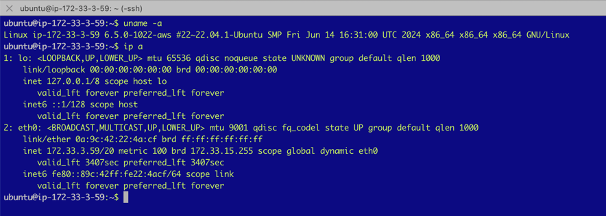

# VPC Peering, Split Brain with Distributed Cross Region NoSQL-DB

## What the Heck!

In this article, we are going to create a well-known split brain problem. This is where we create a network separation within a single, distributed system to observe the effects.

### Steps Overview

1. **Create 2 Unrelated VPCs in AWS:** Each VPC will be in a different region.
2. **Run a Simple 2-Way Chat Message Across the Private Network:** Establish basic communication.
3. **Split the Cross-Region Connection:** Demonstrate traffic blocking.
4. **Install a Distributed Database Spanning the 2 Regions:** Treat it as a single system.
5. **Enable Strong Consistency Features and Rules:** Ensure data integrity.
6. **Create a Client That Continually Updates Data:** Simulate real-world usage.
7. **Enforce a Network Split:** Create the split brain scenario.
8. **Evaluate the Results:** Analyze the outcomes.

### Part 1: Talking Chat Across Regions

#### Selecting Our 2 Regions

**Region 1:**
Open a new browser tab and select the region. For this example, we will use eu-west-2, which is London. Ensure you have the key pairs downloaded, as we will need these later to log in to the host.


**Region 2:**
Open a new browser tab and select a different region. For the second region, we will use eu-west-3, which is Paris. Again, ensure you have the key pairs downloaded for logging in to the host.


By following these steps, we will demonstrate the impact of a network split on a distributed, cross-region NoSQL database.
But before that we will test our cross region connection with a simple chat app with no coding involved. 

#### VPC in Region London 🏴󠁧󠁢󠁥󠁮󠁧󠁿 󠁧󠁢󠁥󠁮󠁧󠁿󠁧󠁢󠁥

From AWS the console, visit the VPC Dashboard and create a new VPC named 'my-vpc-london-2' with the IPv4 CIDR block 172.32.0.0/16.

Next, we need to add subnets for the various availability zones and attach an internet gateway, linking these to a new routing table.

Create the subnets for each availability zone in the VPC we just created:

- **First Availability Zone**
    - Set the IPv4 subnet CIDR block to 172.32.32.0/20.
    - Subnet name: my-subnet-2a
    - Select the availability zone: eu-west-2a

- **Second Availability Zone**
    - Set the IPv4 subnet CIDR block to 172.32.16.0/20.
    - Subnet name: my-subnet-2b
    - Select the availability zone: eu-west-2b

- **Third Availability Zone**
    - Set the IPv4 subnet CIDR block to 172.32.0.0/20.
    - Subnet name: my-subnet-2c
    - Select the availability zone: eu-west-2c


Under Your VPCs --> Resource Map, you should now see the subnets added.


Create a new Internet Gateway and then add it to the Routing Table. Check that you can see this in the Resource Map.

#### EC2 Host in Region London 🏴󠁧󠁢󠁥󠁮󠁧󠁿

Launch an EC2 instance with the following settings:

- **Image:** Canonical, Ubuntu, 22.04 LTS, amd64 jammy image built on 2024-07-01
- **Instance Type:** t2-micro
- **Key Pair:** Select the key you created earlier and downloaded safely.
- **VPC:** Select the VPC we created earlier.
- **Subnet:** Choose the subnet we created earlier for the availability zone this host will be placed in.
- **Auto Assign Public IP:** In production, you would probably disable this and use a jump box. For simplicity, we will SSH directly using the public IP.
- **Security Group:** Create a new security group named my-sg-1.
- **Security Group Rule:** Add a custom TCP rule for ports 3000-3003, source from anywhere.

Login using SSH and your key to ensure step 1 completed successfully:

```sh
ssh -o IdentitiesOnly=yes -i aws-instance-key-london-2.pem ubuntu@35.177.110.209
```


Congratulations, your first region is complete. Let's move on to the second region, Paris!

#### VPC in Region Paris 🇫🇷

From the browser tab with the Paris region selected, go to the VPC Dashboard and create a new VPC. Ensure the CIDR blocks do not overlap with the London VPC. Use the IPv4 CIDR block 172.33.0.0/16.

Next, add subnets for the various availability zones and attach an internet gateway, linking these to a new routing table, just as we did before.

Create the subnets for each availability zone in the VPC we just created:

- **First Availability Zone**
    - Set the IPv4 subnet CIDR block to 172.33.16.0/20.
    - Subnet name: my-subnet-3a
    - Select the availability zone: eu-west-3a

- **Second Availability Zone**
    - Set the IPv4 subnet CIDR block to 172.33.0.0/20.
    - Subnet name: my-subnet-3b
    - Select the availability zone: eu-west-3b

- **Third Availability Zone**
    - Set the IPv4 subnet CIDR block to 172.33.32.0/20.
    - Subnet name: my-subnet-3c
    - Select the availability zone: eu-west-3c


Create a new Internet Gateway and then add it to the Routing Table. Check that you can see this in the Resource Map.


#### EC2 Host in Region Paris 🇫🇷

Launch an EC2 instance with the following settings:

- **Image:** ubuntu/images/hvm-ssd/ubuntu-jammy-22.04-amd64-server-20240701
- **Instance Type:** t2-micro
- **Key Pair:** Select the key you created earlier and downloaded safely.
- **VPC:** Select the VPC we created earlier.
- **Subnet:** Choose the subnet we created earlier for the availability zone this host will be placed in.
- **Auto Assign Public IP:** In production, you would probably disable this and use a jump box. For simplicity, we will SSH directly using the public IP.
- **Security Group:** Create a new security group named my-sg-1.
- **Security Group Rule:** Add a custom TCP rule for ports 3000-3003, source from anywhere.

Login using SSH and your key to ensure step 2 completed successfully:

```sh
ssh -o IdentitiesOnly=yes -i aws-instance-key-paris-1.pem ubuntu@13.38.38.248
```



Congratulations, your second region is complete.

#### VPC Peering - Stretched Network

The following diagram shows what we intend to achieve with our cross-regional network. We will use AWS's VPC peering to achieve this seamlessly. We will test that we can reach each region with a simple yet powerful chat application.


- **Paris VPC** 🇫🇷
    - Under Your VPCs --> Peering Connections, create a new peering connection.
    - Name it 'my-pc-to-london-1'.
    - As the VPC ID (Requester), select the VPC we created earlier.
    - Select another VPC to peer with in another region; in our example, it's London (eu-west-2). Enter the VPC ID for the VPC in London.

  

- **London VPC** 🏴󠁧󠁢󠁥󠁮󠁧󠁿
    - Go to the London VPCs --> Peering Connections and accept the request made from the Paris VPC. You might be prompted to update the routing table. If so, accept it.
    - Update the routing table:
        - **Target:** VPC peering
        - **Destination:** Paris CIDR 172.33.0.0/16

  

#### Chat Application (using `nc` Netcat)

From the London EC2 instance, start an `nc` server on port 3000:

```sh
nc -l -k -p 3000
```

From the Paris EC2 instance, establish a client connection to the London server:

```sh
nc 172.32.34.147 3000
```

You can now start chatting. All your messages are being sent across the channel literally!


### Part 2: Aerospike NoSQL DB Stretch Cluster

In this section we are going to create a 6 node stretch cluster NoSQL DB where each region shares 3 nodes each. The following diagram shows the stretch cluster. Every node interconnects with each other node. 
Becuase of the VPC peering additional latencies may seen for replica updates although this is not a concern for this topic.


#### Create 6 ec2 database hosts 

For each of the regions create 3 nodes and choose the VPC you created earlier, enable public IP assignments and use the same security group.

#### EC2 database hosts in Region London 🏴󠁧󠁢󠁥󠁮󠁧󠁿

Launch 3 x EC2 instance with the following settings:

- **Image:** Rocky-8-EC2-Base-8.7-20230215.0.x86_64 ( ami-07d2b4d8d9980a125 )
- **Instance Type:** t3a.medium ( not what you would use in production )
- **Key Pair:** Select the key you created earlier and downloaded safely.
- **VPC:** Select the VPC we created earlier.
- **Subnet:** Choose the subnet we created earlier for the availability zone this host will be placed in.
- **Auto Assign Public IP:** In production, you would probably disable this and use a jump box. For simplicity, we will SSH directly using the public IP.
- **Security Group:** Use the same security group from earlier.
- **Security Group Rule:** None so far
- **Volumes:** Root Volume: 1x10GB-gp2, 1x8GB-gp3

#### EC2 database hosts in Region Paris 🇫🇷

Launch 3 x EC2 instance with the following settings:

- **Image:** Rocky-8-EC2-LVM-8.7-20230215.0.x86_64 ( ami-064a83a6b9c2edb23 )
- **Instance Type:** t3a.medium ( not what you would use in production )
- **Key Pair:** Select the key you created earlier and downloaded safely.
- **VPC:** Select the VPC we created earlier.
- **Subnet:** Choose the subnet we created earlier for the availability zone this host will be placed in.
- **Auto Assign Public IP:** In production, you would probably disable this and use a jump box. For simplicity, we will SSH directly using the public IP.
- **Security Group:** Use the same security group from earlier.
- **Security Group Rule:** None so far
- **Volumes:** Root Volume: 1x10GB-gp2, 1x8GB-gp3

#### Install Aerospike DB


Log into the each host in a singl region using ssh and install Aerospike as follows.
Note some of the comments in the file as these will represent specific changes required for each host.
There are several automation tools that can be used here but to keep things simple and aid the learning 
aspect we will hand craft each of the 6 nodes.

If you are interested in knowing more about Aerospike visit the [Developer website](https://aerospike.com/developer/).

- If you have a license file also knows as a feature file copy this across to the host.
- ssh each into the host machine

EC2 database hosts in Region London 🏴󠁧󠁢󠁥󠁮󠁧󠁿

```bash
export VER="7.1.0.0"
export TOOLS=11.0.0
export OS=el8
export ARCH=x86_64
sudo yum install java-11-openjdk.x86_64 java-11-openjdk java-11-openjdk-devel python3 openssl-devel wget git gcc maven bind-utils sysstat nc -y
SERVER_BIN=aerospike-server-enterprise_${VER}_tools-${TOOLS}_${OS}_${ARCH}
LINK=https://download.aerospike.com/artifacts/aerospike-server-enterprise/${VER}/${SERVER_BIN}.tgz
wget -q $LINK
tar -xvf ${SERVER_BIN}.tgz
NS=mydata
sudo mkdir -p /var/log/aerospike/
sudo mkdir -p /etc/aerospike/
# Zero the data disks
ls -l /dev/nvme1n1 | awk '{print $NF}' | while read -r line; do sudo dd if=/dev/zero of=$line bs=1024 count=8192 oflag=direct; done

export ID=$((1 + $RANDOM % 1000))
export INDEX=A$ID
export IP=`ip a | grep 172 | awk {'print $2'} | cut -f1 -d'/'`
export PIP=`dig +short myip.opendns.com @resolver1.opendns.com`
export S1IP=172.32.15.231 # another london node for IP seeding
export S2IP=172.33.16.172 # another paris node for IP seeding
export DEV1=/dev/nvme1n1

cat <<EOF> aerospike.conf
service {
        proto-fd-max 15000

        node-id $INDEX
        cluster-name test-aerocluster.eu
        transaction-max-ms 1500
        log-local-time true
}

logging {
        file /var/log/aerospike/aerospike.log {
                context any info
        }
}
network {
        service {
               address any
               access-address $IP
               alternate-access-address $PIP
               port 3000
       }

       heartbeat {
              mode mesh
              address $IP
              port 3002 # Heartbeat port for this node.
              mesh-seed-address-port $S1IP 3002
              mesh-seed-address-port $S2IP 3002
              interval 150 # controls how often to send a heartbeat packet
              timeout 10 # number of intervals after which a node is considered to be missing
       }

        fabric {
              port 3001
              channel-meta-recv-threads 8
        }

}
security {
        # enable-security true

        log {
                report-authentication true
                report-sys-admin true
                report-user-admin true
                report-violation true
        }
}

namespace mydata {
        # How many copies of the data
        replication-factor 2

        # How full may the memory become before the server begins eviction
        # (expiring records early)
        evict-sys-memory-pct 50

        # How full may the memory become before the server goes read only
        stop-writes-sys-memory-pct 60

        # How long (in seconds) to keep data after it is written Default days,
        # use 0 to never expire/evict.
        default-ttl 0

  # Specify a percentage of record expiration time, read within this interval of the record’s end of life will generate a touch
        # e.g. with default-ttl of 60s, a read with 12 seconds remaining will touch the record. [ 60 x ( 1 - default-read-touch-ttl-pct ) = 12 ]
        default-read-touch-ttl-pct 20

        # The interval at which the main expiration/eviction thread wakes up,
        # to process the namespace.
        nsup-period 120

        # Disables eviction that may occur at cold start for this namespace only
        disable-cold-start-eviction True

  # Data high availability across racks
        rack-id ${ID}

  # SC Mode
        strong-consistency true

        # (optional) write-block is 8MiB in server 7.0 or later so max-record-size can be used to limit the record size.
        max-record-size 128K

#        storage-engine device {
#                device $DEV1
#
#                post-write-cache 64
#                read-page-cache true
#
#         # How full may the disk become before the server begins eviction
#         # (expiring records early)
#                evict-used-pct 45
#        }
        storage-engine memory {
                file /opt/aerospike/ns1.dat   # Location of a namespace data file on server
                filesize 1G                  # Max size of each file in GiB. Maximum size is 2TiB
                stop-writes-avail-pct 5       # (optional) stop-writes threshold as a percentage of
                                              # devices/files size or data-size.
                stop-writes-used-pct 70       # (optional) stop-writes threshold as a percentage of
                                              # devices/files size, or data-size.
                evict-used-pct 60             # (optional) eviction threshold, as a percentage of
                                              # devices/files size, or data-size.
        }
}
EOF
sudo cp aerospike.conf /etc/aerospike/aerospike.conf


cat <<EOF> aerospike.log.rotation
/var/log/aerospike/aerospike.log {
    daily
    rotate 90
    dateext
    compress
    olddir /var/log/aerospike/
    sharedscripts
    postrotate
        /bin/kill -HUP `pgrep -x asd`
    endscript
}
EOF
sudo cp aerospike.log.rotation /etc/logrotate.d/aerospike

sudo cp features.conf /etc/aerospike/features.conf

cd $SERVER_BIN
sudo ./asinstall

sudo systemctl start aerospike
sudo systemctl status aerospike
```


#### ACL User Authentication

You can run the following command just once on a single host. This will allow us to add database records.
Usually you would have different users and roles for this. But here we are 
using admin. ( not recommended )

```bash 
asadm -Uadmin -Padmin -e "enable; manage acl grant user admin roles read-write"
asadm -Uadmin -Padmin -e "enable; manage acl grant user admin roles sys-admin"
asadm -Uadmin -Padmin -e "enable; show user"
```

Run the following and most typical command to see a view of the current cluster. So far we have only added the 3 nodes in London.
```bash
asadm -e i -Uadmin -Padmin

Seed:        [('127.0.0.1', 3000, None)]
Config_file: /home/rocky/.aerospike/astools.conf, /etc/aerospike/astools.conf
~~~~~~~~~~~~~~~~~~~~~~~~~~~~~~~~~~~~~~~~~~~~~~~~~~Network Information (2024-08-12 09:44:44 UTC)~~~~~~~~~~~~~~~~~~~~~~~~~~~~~~~~~~~~~~~~~~~~~~~~~~~
                                           Node| Node|                IP|    Build|Migrations|~~~~~~~~~~~~~~Cluster~~~~~~~~~~~~~~~|Client|  Uptime
                                               |   ID|                  |         |          |Size|        Key|Integrity|Principal| Conns|
172.32.15.231:3000                             | A352|172.32.15.231:3000|E-7.1.0.0|   0.000  |   3|155A640ADB8|True     |     A600|     7|00:08:16
172.32.4.2:3000                                |*A600|172.32.4.2:3000   |E-7.1.0.0|   0.000  |   3|155A640ADB8|True     |     A600|     7|00:07:43
ip-172-32-5-239.eu-west-2.compute.internal:3000| A129|172.32.5.239:3000 |E-7.1.0.0|   0.000  |   3|155A640ADB8|True     |     A600|     7|00:09:38
Number of rows: 3

~~~~~~~~~~~~~~~~~~~~~~~~~~~~~~~~~~~~~~~~~~~~~~~~~~~~~~~~~~~~~Namespace Usage Information (2024-08-12 09:44:44 UTC)~~~~~~~~~~~~~~~~~~~~~~~~~~~~~~~~~~~~~~~~~~~~~~~~~~~~~~~~~~~~~~
Namespace|                                           Node|Evictions|  Stop|~System Memory~|~~~~Primary Index~~~~|~~Secondary~~~|~~~~~~~~~~~~~~~~~Storage Engine~~~~~~~~~~~~~~~~~
         |                                               |         |Writes| Avail%| Evict%| Type|    Used|Evict%|~~~~Index~~~~~|  Type|    Used|Used%|Evict%|  Used|Avail%|Avail
         |                                               |         |      |       |       |     |        |      | Type|    Used|      |        |     |      | Stop%|      |Stop%
mydata   |172.32.15.231:3000                             |  0.000  |False |     82|     50|shmem|0.000 B | 0.0 %|shmem|0.000 B |memory|0.000 B |0.0 %|60.0 %|70.0 %|99.0 %|5.0 %
mydata   |172.32.4.2:3000                                |  0.000  |False |     82|     50|shmem|0.000 B | 0.0 %|shmem|0.000 B |memory|0.000 B |0.0 %|60.0 %|70.0 %|99.0 %|5.0 %
mydata   |ip-172-32-5-239.eu-west-2.compute.internal:3000|  0.000  |False |     81|     50|shmem|0.000 B | 0.0 %|shmem|0.000 B |memory|0.000 B |0.0 %|60.0 %|70.0 %|99.0 %|5.0 %
mydata   |                                               |  0.000  |      |       |       |     |0.000 B |      |     |0.000 B |      |0.000 B |0.0 %|      |      |      |
Number of rows: 3

~~~~~~~~~~~~~~~~~~~~~~~~~~~~~~~~~~~~~~~~~~~~~~~~~~~~~~Namespace Object Information (2024-08-12 09:44:44 UTC)~~~~~~~~~~~~~~~~~~~~~~~~~~~~~~~~~~~~~~~~~~~~~~~~~~~~~
Namespace|                                           Node|Rack|  Repl|Expirations|  Total|~~~~~~~~~~Objects~~~~~~~~~~|~~~~~~~~~Tombstones~~~~~~~~|~~~~Pending~~~~
         |                                               |  ID|Factor|           |Records| Master|  Prole|Non-Replica| Master|  Prole|Non-Replica|~~~~Migrates~~~
         |                                               |    |      |           |       |       |       |           |       |       |           |     Tx|     Rx
mydata   |172.32.15.231:3000                             | 352|     0|    0.000  |0.000  |0.000  |0.000  |    0.000  |0.000  |0.000  |    0.000  |0.000  |0.000
mydata   |172.32.4.2:3000                                | 600|     0|    0.000  |0.000  |0.000  |0.000  |    0.000  |0.000  |0.000  |    0.000  |0.000  |0.000
mydata   |ip-172-32-5-239.eu-west-2.compute.internal:3000| 129|     0|    0.000  |0.000  |0.000  |0.000  |    0.000  |0.000  |0.000  |    0.000  |0.000  |0.000
mydata   |                                               |    |      |    0.000  |0.000  |0.000  |0.000  |    0.000  |0.000  |0.000  |    0.000  |0.000  |0.000
Number of rows: 3
```

You should now see all 6 nodes in a stretch cluster - how cool.

```bash
sadm -e i -Uadmin -Padmin
Seed:        [('127.0.0.1', 3000, None)]
Config_file: /home/rocky/.aerospike/astools.conf, /etc/aerospike/astools.conf
~~~~~~~~~~~~~~~~~~~~~~~~~~~~~~~~~~~~~~~~~~~~~~~~~~Network Information (2024-08-12 09:56:34 UTC)~~~~~~~~~~~~~~~~~~~~~~~~~~~~~~~~~~~~~~~~~~~~~~~~~~~
                                          Node| Node|                IP|    Build|Migrations|~~~~~~~~~~~~~~~Cluster~~~~~~~~~~~~~~~|Client|  Uptime
                                              |   ID|                  |         |          |Size|         Key|Integrity|Principal| Conns|
172.32.15.231:3000                            | A352|172.32.15.231:3000|E-7.1.0.0|   0.000  |   6|ECACBC564992|True     |     A882|     7|00:20:06
172.32.4.2:3000                               | A600|172.32.4.2:3000   |E-7.1.0.0|   0.000  |   6|ECACBC564992|True     |     A882|     7|00:19:33
172.32.5.239:3000                             | A129|172.32.5.239:3000 |E-7.1.0.0|   0.000  |   6|ECACBC564992|True     |     A882|     7|00:21:28
172.33.11.90:3000                             |  A70|172.33.11.90:3000 |E-7.1.0.0|   0.000  |   6|ECACBC564992|True     |     A882|     6|00:00:39
172.33.8.38:3000                              |*A882|172.33.8.38:3000  |E-7.1.0.0|   0.000  |   6|ECACBC564992|True     |     A882|     7|00:00:46
ip-172-33-7-44.eu-west-3.compute.internal:3000| A517|172.33.7.44:3000  |E-7.1.0.0|   0.000  |   6|ECACBC564992|True     |     A882|     7|00:00:39
Number of rows: 6

~~~~~~~~~~~~~~~~~~~~~~~~~~~~~~~~~~~~~~~~~~~~~~~~~~~~~~~~~~~~~Namespace Usage Information (2024-08-12 09:56:34 UTC)~~~~~~~~~~~~~~~~~~~~~~~~~~~~~~~~~~~~~~~~~~~~~~~~~~~~~~~~~~~~~
Namespace|                                          Node|Evictions|  Stop|~System Memory~|~~~~Primary Index~~~~|~~Secondary~~~|~~~~~~~~~~~~~~~~~Storage Engine~~~~~~~~~~~~~~~~~
         |                                              |         |Writes| Avail%| Evict%| Type|    Used|Evict%|~~~~Index~~~~~|  Type|    Used|Used%|Evict%|  Used|Avail%|Avail
         |                                              |         |      |       |       |     |        |      | Type|    Used|      |        |     |      | Stop%|      |Stop%
mydata   |172.32.15.231:3000                            |  0.000  |False |     78|     50|shmem|0.000 B | 0.0 %|shmem|0.000 B |memory|0.000 B |0.0 %|60.0 %|70.0 %|99.0 %|5.0 %
mydata   |172.32.4.2:3000                               |  0.000  |False |     78|     50|shmem|0.000 B | 0.0 %|shmem|0.000 B |memory|0.000 B |0.0 %|60.0 %|70.0 %|99.0 %|5.0 %
mydata   |172.32.5.239:3000                             |  0.000  |False |     78|     50|shmem|0.000 B | 0.0 %|shmem|0.000 B |memory|0.000 B |0.0 %|60.0 %|70.0 %|99.0 %|5.0 %
mydata   |172.33.11.90:3000                             |  0.000  |False |     78|     50|shmem|0.000 B | 0.0 %|shmem|0.000 B |memory|0.000 B |0.0 %|60.0 %|70.0 %|99.0 %|5.0 %
mydata   |172.33.8.38:3000                              |  0.000  |False |     78|     50|shmem|0.000 B | 0.0 %|shmem|0.000 B |memory|0.000 B |0.0 %|60.0 %|70.0 %|99.0 %|5.0 %
mydata   |ip-172-33-7-44.eu-west-3.compute.internal:3000|  0.000  |False |     77|     50|shmem|0.000 B | 0.0 %|shmem|0.000 B |memory|0.000 B |0.0 %|60.0 %|70.0 %|99.0 %|5.0 %
mydata   |                                              |  0.000  |      |       |       |     |0.000 B |      |     |0.000 B |      |0.000 B |0.0 %|      |      |      |
Number of rows: 6

~~~~~~~~~~~~~~~~~~~~~~~~~~~~~~~~~~~~~~~~~~~~~~~~~~~~~Namespace Object Information (2024-08-12 09:56:34 UTC)~~~~~~~~~~~~~~~~~~~~~~~~~~~~~~~~~~~~~~~~~~~~~~~~~~~~~
Namespace|                                          Node|Rack|  Repl|Expirations|  Total|~~~~~~~~~~Objects~~~~~~~~~~|~~~~~~~~~Tombstones~~~~~~~~|~~~~Pending~~~~
         |                                              |  ID|Factor|           |Records| Master|  Prole|Non-Replica| Master|  Prole|Non-Replica|~~~~Migrates~~~
         |                                              |    |      |           |       |       |       |           |       |       |           |     Tx|     Rx
mydata   |172.32.15.231:3000                            | 352|     0|    0.000  |0.000  |0.000  |0.000  |    0.000  |0.000  |0.000  |    0.000  |0.000  |0.000
mydata   |172.32.4.2:3000                               | 600|     0|    0.000  |0.000  |0.000  |0.000  |    0.000  |0.000  |0.000  |    0.000  |0.000  |0.000
mydata   |172.32.5.239:3000                             | 129|     0|    0.000  |0.000  |0.000  |0.000  |    0.000  |0.000  |0.000  |    0.000  |0.000  |0.000
mydata   |172.33.11.90:3000                             |  70|     0|    0.000  |0.000  |0.000  |0.000  |    0.000  |0.000  |0.000  |    0.000  |0.000  |0.000
mydata   |172.33.8.38:3000                              | 882|     0|    0.000  |0.000  |0.000  |0.000  |    0.000  |0.000  |0.000  |    0.000  |0.000  |0.000
mydata   |ip-172-33-7-44.eu-west-3.compute.internal:3000| 517|     0|    0.000  |0.000  |0.000  |0.000  |    0.000  |0.000  |0.000  |    0.000  |0.000  |0.000
mydata   |                                              |    |      |    0.000  |0.000  |0.000  |0.000  |    0.000  |0.000  |0.000  |    0.000  |0.000  |0.000
```

#### Strong Consistency

To enable the SC rules you will need to run some admin commands as below

```bash
enable
manage roster stage observed ns mydata
manage recluster
```

Run the following to verify that the nodes are part of the roster
```bash
show racks
~Racks (2024-08-12 10:00:00 UTC)~
Namespace|Rack|Nodes
         |  ID|
mydata   |  70|A70
mydata   | 129|A129
mydata   | 352|A352
mydata   | 517|A517
mydata   | 600|A600
mydata   | 882|A882
Number of rows: 6

show roster
~~~~~~~~~~~~~~~~~~~~~~~~~~~~~~~~~~~~~~~~~~~~~~~~~~~~~~~~~~~~~~~~~~~~~~~~~~~~~~~~~~~~~~~~~~~~~Roster (2024-08-12 10:00:03 UTC)~~~~~~~~~~~~~~~~~~~~~~~~~~~~~~~~~~~~~~~~~~~~~~~~~~~~~~~~~~~~~~~~~~~~~~~~~~~~~~~~~~~~~~~~~~~~~
                                          Node| Node|Namespace|                                     Current Roster|                                     Pending Roster|                                     Observed Nodes
                                              |   ID|         |                                                   |                                                   |
172.32.5.239:3000                             |A129 |mydata   |A882@882,A600@600,A517@517,A352@352,A129@129,A70@70|A882@882,A600@600,A517@517,A352@352,A129@129,A70@70|A882@882,A600@600,A517@517,A352@352,A129@129,A70@70
172.32.15.231:3000                            |A352 |mydata   |A882@882,A600@600,A517@517,A352@352,A129@129,A70@70|A882@882,A600@600,A517@517,A352@352,A129@129,A70@70|A882@882,A600@600,A517@517,A352@352,A129@129,A70@70
ip-172-33-7-44.eu-west-3.compute.internal:3000|A517 |mydata   |A882@882,A600@600,A517@517,A352@352,A129@129,A70@70|A882@882,A600@600,A517@517,A352@352,A129@129,A70@70|A882@882,A600@600,A517@517,A352@352,A129@129,A70@70
172.32.4.2:3000                               |A600 |mydata   |A882@882,A600@600,A517@517,A352@352,A129@129,A70@70|A882@882,A600@600,A517@517,A352@352,A129@129,A70@70|A882@882,A600@600,A517@517,A352@352,A129@129,A70@70
172.33.11.90:3000                             |A70  |mydata   |A882@882,A600@600,A517@517,A352@352,A129@129,A70@70|A882@882,A600@600,A517@517,A352@352,A129@129,A70@70|A882@882,A600@600,A517@517,A352@352,A129@129,A70@70
172.33.8.38:3000                              |*A882|mydata   |A882@882,A600@600,A517@517,A352@352,A129@129,A70@70|A882@882,A600@600,A517@517,A352@352,A129@129,A70@70|A882@882,A600@600,A517@517,A352@352,A129@129,A70@70
Number of rows: 6
```

All nodes should be on the current roster. We're good to go. <i>But wait!</I>
 You may have noticed there are 6 racks which doesn't make much sense here. 
Recall we have 3 nodes in 2 regions and in each region all the nodes are in a single subnet, 
so that translates to 2 racks. See the diagram at the top of Part 2: Aerospike NoSQL DB Stretch Cluster.

Action: Edit the cluster so we have only 2 rack.

```bash
asadm -Uadmin -Padmin

# show the roster
Admin+> show roster
~~~~~~~~~~~~~~~~~~~~~~~~~~~~~~~~~~~~~~~~~~~~~~~~~~~~~~~~~~~~~~~~~~~~~~~~~~~~~Roster (2024-08-12 11:24:49 UTC)~~~~~~~~~~~~~~~~~~~~~~~~~~~~~~~~~~~~~~~~~~~~~~~~~~~~~~~~~~~~~~~~~~~~~~~~~~~~~
                                           Node| Node|Namespace|                          Current Roster|                          Pending Roster|                          Observed Nodes
                                               |   ID|         |                                        |                                        |
ip-172-32-5-239.eu-west-2.compute.internal:3000|A129 |mydata   |A882@2,A600@1,A517@2,A352@1,A129@1,A70@2|A882@2,A600@1,A517@2,A352@1,A129@1,A70@2|A882@2,A600@1,A517@2,A352@1,A129@1,A70@2
172.32.15.231:3000                             |A352 |mydata   |A882@2,A600@1,A517@2,A352@1,A129@1,A70@2|A882@2,A600@1,A517@2,A352@1,A129@1,A70@2|A882@2,A600@1,A517@2,A352@1,A129@1,A70@2
172.33.7.44:3000                               |A517 |mydata   |A882@2,A600@1,A517@2,A352@1,A129@1,A70@2|A882@2,A600@1,A517@2,A352@1,A129@1,A70@2|A882@2,A600@1,A517@2,A352@1,A129@1,A70@2
172.32.4.2:3000                                |A600 |mydata   |A882@2,A600@1,A517@2,A352@1,A129@1,A70@2|A882@2,A600@1,A517@2,A352@1,A129@1,A70@2|A882@2,A600@1,A517@2,A352@1,A129@1,A70@2
172.33.11.90:3000                              |A70  |mydata   |A882@2,A600@1,A517@2,A352@1,A129@1,A70@2|A882@2,A600@1,A517@2,A352@1,A129@1,A70@2|A882@2,A600@1,A517@2,A352@1,A129@1,A70@2
172.33.8.38:3000                               |*A882|mydata   |A882@2,A600@1,A517@2,A352@1,A129@1,A70@2|A882@2,A600@1,A517@2,A352@1,A129@1,A70@2|A882@2,A600@1,A517@2,A352@1,A129@1,A70@2
Number of rows: 6

# remove the n-1 nodes from the cluster
manage roster remove nodes A882@2 A600@1 A517@2 A352@1 A129@1 ns mydata

# check the current roster should be only 1 node
show roster
~~~~~~~~~~~~~~~~~~~~~~~~~~~~~~~~~~~~~~~~~~~~Roster (2024-08-12 11:25:26 UTC)~~~~~~~~~~~~~~~~~~~~~~~~~~~~~~~~~~~~~~~~~~~~
                                           Node| Node|Namespace|Current|Pending|                          Observed Nodes
                                               |   ID|         | Roster| Roster|
ip-172-32-5-239.eu-west-2.compute.internal:3000|A129 |mydata   |A70@2  |A70@2  |A882@2,A600@1,A517@2,A352@1,A129@1,A70@2
172.32.15.231:3000                             |A352 |mydata   |A70@2  |A70@2  |A882@2,A600@1,A517@2,A352@1,A129@1,A70@2
172.33.7.44:3000                               |A517 |mydata   |A70@2  |A70@2  |A882@2,A600@1,A517@2,A352@1,A129@1,A70@2
172.32.4.2:3000                                |A600 |mydata   |A70@2  |A70@2  |A882@2,A600@1,A517@2,A352@1,A129@1,A70@2
172.33.11.90:3000                              |A70  |mydata   |A70@2  |A70@2  |A882@2,A600@1,A517@2,A352@1,A129@1,A70@2
172.33.8.38:3000                               |*A882|mydata   |A70@2  |A70@2  |A882@2,A600@1,A517@2,A352@1,A129@1,A70@2
Number of rows: 6

# change the rack ids
manage config namespace mydata param rack-id to 32 with A129 A352 A600
manage recluster
info

manage config namespace mydata param rack-id to 33 with A70 A517 A882
manage recluster
info

manage roster stage observed A882@33,A600@32,A517@33,A352@32,A129@32,A70@33 ns mydata
manage recluster
show roster
~~~~~~~~~~~~~~~~~~~~~~~~~~~~~~~~~~~~~~~~~~~~~~~~~~~~~~~~~~~~~~~~~~~~~~~~~~~~~~~~~~~~~~Roster (2024-08-12 11:31:08 UTC)~~~~~~~~~~~~~~~~~~~~~~~~~~~~~~~~~~~~~~~~~~~~~~~~~~~~~~~~~~~~~~~~~~~~~~~~~~~~~~~~~~~~~~
                                           Node| Node|Namespace|                                Current Roster|                                Pending Roster|                                Observed Nodes
                                               |   ID|         |                                              |                                              |
ip-172-32-5-239.eu-west-2.compute.internal:3000|A129 |mydata   |A882@33,A600@32,A517@33,A352@32,A129@32,A70@33|A882@33,A600@32,A517@33,A352@32,A129@32,A70@33|A882@33,A600@32,A517@33,A352@32,A129@32,A70@33
172.32.15.231:3000                             |A352 |mydata   |A882@33,A600@32,A517@33,A352@32,A129@32,A70@33|A882@33,A600@32,A517@33,A352@32,A129@32,A70@33|A882@33,A600@32,A517@33,A352@32,A129@32,A70@33
172.33.7.44:3000                               |A517 |mydata   |A882@33,A600@32,A517@33,A352@32,A129@32,A70@33|A882@33,A600@32,A517@33,A352@32,A129@32,A70@33|A882@33,A600@32,A517@33,A352@32,A129@32,A70@33
172.32.4.2:3000                                |A600 |mydata   |A882@33,A600@32,A517@33,A352@32,A129@32,A70@33|A882@33,A600@32,A517@33,A352@32,A129@32,A70@33|A882@33,A600@32,A517@33,A352@32,A129@32,A70@33
172.33.11.90:3000                              |A70  |mydata   |A882@33,A600@32,A517@33,A352@32,A129@32,A70@33|A882@33,A600@32,A517@33,A352@32,A129@32,A70@33|A882@33,A600@32,A517@33,A352@32,A129@32,A70@33
172.33.8.38:3000                               |*A882|mydata   |A882@33,A600@32,A517@33,A352@32,A129@32,A70@33|A882@33,A600@32,A517@33,A352@32,A129@32,A70@33|A882@33,A600@32,A517@33,A352@32,A129@32,A70@33
Number of rows: 6

show racks
~Racks (2024-08-12 11:31:34 UTC)~
Namespace|Rack|         Nodes
         |  ID|
mydata   |  32|A600,A352,A129
mydata   |  33|A882,A517,A70
Number of rows: 2
```

So we have successfully updated our racks. Don't forget to change the rack-id in the config file.


