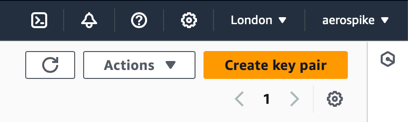

# VPC Peering, Split Brain with Distributed Cross Region NoSQL-DB

## What the Heck!

In this article, we are going to create a well-known split brain problem. This is where we create a network separation within a single, distributed system to observe the effects.

### Steps Overview

1. **Create 2 Unrelated VPCs in AWS:** Each VPC will be in a different region.
2. **Run a Simple 2-Way Chat Message Across the Private Network:** Establish basic communication.
3. **Split the Cross-Region Connection:** Demonstrate traffic blocking.
4. **Install a Distributed Database Spanning the 2 Regions:** Treat it as a single system.
5. **Enable Strong Consistency Features and Rules:** Ensure data integrity.
6. **Create a Client That Continually Updates Data:** Simulate real-world usage.
7. **Enforce a Network Split:** Create the split brain scenario.
8. **Evaluate the Results:** Analyze the outcomes.

### Part 1: Talking Chat Across Regions

#### Selecting Our 2 Regions

**Region 1:**
Open a new browser tab and select the region. For this example, we will use eu-west-2, which is London. Ensure you have the key pairs downloaded, as we will need these later to log in to the host.



**Region 2:**
Open a new browser tab and select a different region. For the second region, we will use eu-west-3, which is Paris. Again, ensure you have the key pairs downloaded for logging in to the host.


By following these steps, we will demonstrate the impact of a network split on a distributed, cross-region NoSQL database.
But before that we will test our cross region connection with a simple chat app with no coding involved. 

#### VPC in Region London

From AWS the console, visit the VPC Dashboard and create a new VPC named 'my-vpc-london-2' with the IPv4 CIDR block 172.32.0.0/16.

Next, we need to add subnets for the various availability zones and attach an internet gateway, linking these to a new routing table.

Create the subnets for each availability zone in the VPC we just created:

- **First Availability Zone**
    - Set the IPv4 subnet CIDR block to 172.32.32.0/20.
    - Subnet name: my-subnet-2a
    - Select the availability zone: eu-west-2a

- **Second Availability Zone**
    - Set the IPv4 subnet CIDR block to 172.32.16.0/20.
    - Subnet name: my-subnet-2b
    - Select the availability zone: eu-west-2b

- **Third Availability Zone**
    - Set the IPv4 subnet CIDR block to 172.32.0.0/20.
    - Subnet name: my-subnet-2c
    - Select the availability zone: eu-west-2c


Under Your VPCs --> Resource Map, you should now see the subnets added.


Create a new Internet Gateway and then add it to the Routing Table. Check that you can see this in the Resource Map.

#### EC2 Host in Region London

Launch an EC2 instance with the following settings:

- **Image:** Canonical, Ubuntu, 22.04 LTS, amd64 jammy image built on 2024-07-01
- **Instance Type:** t2-micro
- **Key Pair:** Select the key you created earlier and downloaded safely.
- **VPC:** Select the VPC we created earlier.
- **Subnet:** Choose the subnet we created earlier for the availability zone this host will be placed in.
- **Auto Assign Public IP:** In production, you would probably disable this and use a jump box. For simplicity, we will SSH directly using the public IP.
- **Security Group:** Create a new security group named my-sg-1.
- **Security Group Rule:** Add a custom TCP rule for ports 3000-3003, source from anywhere.

Login using SSH and your key to ensure step 1 completed successfully:

```sh
ssh -o IdentitiesOnly=yes -i aws-instance-key-london-2.pem ubuntu@35.177.110.209
```


Congratulations, your first region is complete. Let's move on to the second region, Paris!

#### VPC in Region Paris

From the browser tab with the Paris region selected, go to the VPC Dashboard and create a new VPC. Ensure the CIDR blocks do not overlap with the London VPC. Use the IPv4 CIDR block 172.33.0.0/16.

Next, add subnets for the various availability zones and attach an internet gateway, linking these to a new routing table, just as we did before.

Create the subnets for each availability zone in the VPC we just created:

- **First Availability Zone**
    - Set the IPv4 subnet CIDR block to 172.33.16.0/20.
    - Subnet name: my-subnet-3a
    - Select the availability zone: eu-west-3a

- **Second Availability Zone**
    - Set the IPv4 subnet CIDR block to 172.33.0.0/20.
    - Subnet name: my-subnet-3b
    - Select the availability zone: eu-west-3b

- **Third Availability Zone**
    - Set the IPv4 subnet CIDR block to 172.33.32.0/20.
    - Subnet name: my-subnet-3c
    - Select the availability zone: eu-west-3c


Create a new Internet Gateway and then add it to the Routing Table. Check that you can see this in the Resource Map.


#### EC2 Host in Region Paris

Launch an EC2 instance with the following settings:

- **Image:** ubuntu/images/hvm-ssd/ubuntu-jammy-22.04-amd64-server-20240701
- **Instance Type:** t2-micro
- **Key Pair:** Select the key you created earlier and downloaded safely.
- **VPC:** Select the VPC we created earlier.
- **Subnet:** Choose the subnet we created earlier for the availability zone this host will be placed in.
- **Auto Assign Public IP:** In production, you would probably disable this and use a jump box. For simplicity, we will SSH directly using the public IP.
- **Security Group:** Create a new security group named my-sg-1.
- **Security Group Rule:** Add a custom TCP rule for ports 3000-3003, source from anywhere.

Login using SSH and your key to ensure step 2 completed successfully:

```sh
ssh -o IdentitiesOnly=yes -i aws-instance-key-paris-1.pem ubuntu@13.38.38.248
```


Congratulations, your second region is complete.

#### VPC Peering - Stretched Network

The following diagram shows what we intend to achieve with our cross-regional network. We will use AWS's VPC peering to achieve this seamlessly. We will test that we can reach each region with a simple yet powerful chat application.


- **Paris VPC**
    - Under Your VPCs --> Peering Connections, create a new peering connection.
    - Name it 'my-pc-to-london-1'.
    - As the VPC ID (Requester), select the VPC we created earlier.
    - Select another VPC to peer with in another region; in our example, it's London (eu-west-2). Enter the VPC ID for the VPC in London.

  

- **London VPC**
    - Go to the London VPCs --> Peering Connections and accept the request made from the Paris VPC. You might be prompted to update the routing table. If so, accept it.
    - Update the routing table:
        - **Target:** VPC peering
        - **Destination:** Paris CIDR 172.33.0.0/16

  

#### Chat Application (using `nc` Netcat)

From the London EC2 instance, start an `nc` server on port 3000:

```sh
nc -l -k -p 3000
```

From the Paris EC2 instance, establish a client connection to the London server:

```sh
nc 172.32.34.147 3000
```

You can now start chatting. All your messages are being sent across the channel literally!


### Part 2: Aerospike NoSQL DB Stretch Cluster

In this section we are going to create a 4 node stretch cluster NoSQL DB where each region shares 2 nodes each. The following diagram shows the stretch cluster. Every node interconnects with each other node. 
Becuase of the VPC peering additional latencies may seen for replica updates although this is not a concern for this topic.


#### Create 6 ec2 database hosts 

For each of the regions create 3 nodes and choose the VPC you created earlier, enable public IP assignments and use the same security group.

#### EC2 database hosts in Region London

Launch 3 x EC2 instance with the following settings:

- **Image:** Rocky-8-EC2-Base-8.7-20230215.0.x86_64 ( ami-07d2b4d8d9980a125 )
- **Instance Type:** t3a.medium ( not what you would use in production )
- **Key Pair:** Select the key you created earlier and downloaded safely.
- **VPC:** Select the VPC we created earlier.
- **Subnet:** Choose the subnet we created earlier for the availability zone this host will be placed in.
- **Auto Assign Public IP:** In production, you would probably disable this and use a jump box. For simplicity, we will SSH directly using the public IP.
- **Security Group:** Use the same security group from earlier.
- **Security Group Rule:** None so far


