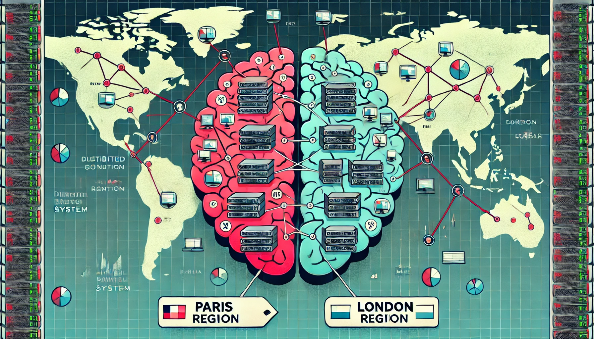

# VPC Peering, Split Brain with Distributed Cross Region NoSQL-DB


In this experiment, we knowingly and abruptly create a network separation within a live distributed database. 
The system is split evenly across two geo-regions in equal proportion. 
Each region maintains its partition subset. 
This way we can clearly understand the robustness and behavior of a distributed system under partitioned conditions.
By understanding these scenarios can help solution architects design resilient systems that handle various partitioning cases effectively.

While this article focuses on an equal partition split, it's also crucial to test unequal splits. 
In a minority-majority scenario, the majority partition will continue to handle operations with quorum, while the minority partition may face availability issues. 
I will discuss this in detail in a separate article.

I've structured this blog into a series of five articles, each corresponding to a different phase of the experiment. 
Each phase will demand a unique set of skills. 
For instance, on Day 1, you'll be exploring AWS Virtual Private Networks and Peering, 
while on Day 2, you'll take on the role of a DBA, each day introducing you to a different challenge.


-  **Day 1** - Simple cross-region messaging application
-  **Day 2** - Aerospike NoSQL DB Stretch Cluster
-  **Day 3** - Python Application - Test Data
-  **Day 4** - Split Brain
-  **Day 5** - Partition Management Strong Consistency
-  **Day 6** - (optional bonus day)

## Overview

This is what we plan to do over the next 5 days.

1. Create 2 Unrelated VPCs in AWS, each VPC will be in a different region.
2. Establish basic communication using a simple chat message app over the private network.
3. Demonstrate traffic blocking by splitting the cross-regional connection.
4. Install a Distributed Database spanning the 2 regions and treat it as a single system.
5. Verify data integrity by enabling strong consistency features and rules.
6. Simulate real-world traffic using a simple Python data loader
7. Enforce a network split that will create the split brain scenario.
8. Evaluate the Results. 

<p id="chat-section"><h2>Day 1: Talking Cross Region</h2></p>

Selecting Our 2 Regions

In a browser navigate to the top right hand corner and select a unique region. 
For this example, we will use `eu-west-2`, which is London. Verify you have the correct key pairs downloaded, as you will need these later to log in to the host.


Open a new tab and select a different region. 
For the second region, we will use `eu-west-3`, which is Paris. 
Again, verify you have the correct key pairs downloaded for logging in to the host.


By following these steps, we will demonstrate the impact of a network split on a distributed, cross-regional NoSQL database.
But before that, we will test our cross-regional connections with a simple messaging tool with no application coding involved. 

#### VPC in Region London 🏴󠁧󠁢󠁥󠁮󠁧󠁿 󠁧󠁢󠁥󠁮󠁧󠁿󠁧󠁢󠁥

From the AWS console, visit the VPC Dashboard and create a new VPC named 'my-vpc-london-2' with the IPv4 CIDR block 172.32.0.0/16.

Next, we will add subnets for the various availability zones and attach a new internet gateway, linking all of these to a new routing table.

Create the subnets for each availability zone in the VPC we just created:

- First Availability Zone
    - Set the IPv4 subnet CIDR block to 172.32.32.0/20.
    - Subnet name: my-subnet-2a
    - Select the availability zone: eu-west-2a

- Second Availability Zone
    - Set the IPv4 subnet CIDR block to 172.32.16.0/20.
    - Subnet name: my-subnet-2b
    - Select the availability zone: eu-west-2b

- Third Availability Zone
    - Set the IPv4 subnet CIDR block to 172.32.0.0/20.
    - Subnet name: my-subnet-2c
    - Select the availability zone: eu-west-2c


Under Your VPCs &rarr; Resource Map, you should now see the subnets added.


Create a new Internet Gateway and then add it to the Routing Table. Check that you can see this in the Resource Map.

#### EC2 Host in Region London 🏴󠁧󠁢󠁥󠁮󠁧󠁿

Launch an EC2 instance with the following settings:


| Parameter              | Value                                                                                         |
|------------------------|-----------------------------------------------------------------------------------------------|
| Image                  | Canonical, Ubuntu, 22.04 LTS, amd64 jammy image built on 2024-07-01                           |
| Instance Type          | t2-micro                                                                                      |
| Key Pair               | Select the key you created earlier and downloaded safely.                                     |
| VPC                    | Select the VPC we created earlier.                                                            |
| Subnet                 | Choose the subnet we created earlier for the availability zone this host will be placed in.   |
| Auto Assign Public IP  | In production, you would probably disable this and use a jump box. For simplicity, we will SSH directly using the public IP. |
| Security Group         | Create a new security group named my-sg-1.                                                    |
| Security Group Rule    | Add a custom TCP rule for ports 3000-3003, source from anywhere.                              |

Login using SSH and your associated key to verify step 1 completed successfully:

```sh
ssh -o IdentitiesOnly=yes -i aws-instance-key-london-2.pem ubuntu@35.177.110.209
```


Congratulations, your first region is complete. Let's move on to the second region, Paris!

#### VPC in Region Paris 🇫🇷

From the browser tab with the Paris region selected, go to the VPC Dashboard and create a new VPC. Verify the CIDR blocks do not overlap with the London VPC. Use the IPv4 CIDR block 172.33.0.0/16.

Next, we will add subnets for the various availability zones and attach a new internet gateway, linking all of these to a new routing table, just as we did before.

Create the subnets for each availability zone in the VPC we just created:

- First Availability Zone
    - Set the IPv4 subnet CIDR block to 172.33.16.0/20.
    - Subnet name: my-subnet-3a
    - Select the availability zone: eu-west-3a

- Second Availability Zone
    - Set the IPv4 subnet CIDR block to 172.33.0.0/20.
    - Subnet name: my-subnet-3b
    - Select the availability zone: eu-west-3b

- Third Availability Zone
    - Set the IPv4 subnet CIDR block to 172.33.32.0/20.
    - Subnet name: my-subnet-3c
    - Select the availability zone: eu-west-3c


Create a new Internet Gateway and then add it to the Routing Table. Check that you can see this in the Resource Map.


#### EC2 Host in Region Paris 🇫🇷

Launch an EC2 instance with the following settings:

| Parameter              | Value                                                                                         |
|------------------------|-----------------------------------------------------------------------------------------------|
| Image                  | ubuntu/images/hvm-ssd/ubuntu-jammy-22.04-amd64-server-20240701                                |
| Instance Type          | t2-micro                                                                                      |
| Key Pair               | Select the key you created earlier and downloaded safely.                                     |
| VPC                    | Select the VPC we created earlier.                                                            |
| Subnet                 | Choose the subnet we created earlier for the availability zone this host will be placed in.   |
| Auto Assign Public IP  | In production, you would probably disable this and use a secure jump box. For simplicity, we will SSH directly using the public IP. |
| Security Group         | Create a new security group named my-sg-1.                                                    |
| Security Group Rule    | Add a custom TCP rule for ports 3000-3003, source from anywhere.                              |


Login using SSH and associated key to verify step 2 completed successfully:

```sh
ssh -o IdentitiesOnly=yes -i aws-instance-key-paris-1.pem ubuntu@13.38.38.248
```


Congratulations, your second region is complete.

#### VPC Peering - Stretched Network

The following diagram shows what we intend to achieve with our cross-regional network. We will use AWS's VPC peering to achieve this seamlessly. We will test that we can reach each region with a simple yet powerful networking tool.


- **Paris VPC** 🇫🇷
    - Under Your VPCs &rarr; Peering Connections, create a new peering connection.
    - Name it 'my-pc-to-london-1'.
    - As the VPC ID (Requester), select the VPC we created earlier.
    - Select another VPC to peer with in another region; in our example, it's London (eu-west-2). Enter the VPC ID for the VPC in London.

  


- **London VPC** 🏴󠁧󠁢󠁥󠁮󠁧󠁿
    - Go to the London VPCs &rarr; Peering Connections and accept the request made from the Paris VPC. You might be prompted to update the routing table. If so, accept it.
    - Update the routing table:
        - Target: VPC peering
        - Destination: Paris CIDR 172.33.0.0/16

  

#### Messaging 'chat' (using `nc` Netcat)

From the London EC2 instance, start an `nc` server on port 3000 with the following switches:

```sh
nc -l -k -p 3000
```

From the Paris EC2 instance, establish a client connection to the London server:

```sh
nc 172.32.34.147 3000
```

You can now start chatting as all your messages are being sent across the channel literally!


<p id="stretch-cluster-section"><h2>Day 2: Aerospike NoSQL DB Stretch Cluster</h2></p>

In this section, we will create a 6-node stretch cluster NoSQL DB, with each region hosting 3 nodes. The following diagram illustrates the stretch cluster configuration, where every node interconnects with each other node. Due to VPC peering, additional latencies may be observed for replica updates, but this is not a concern for this topic.


#### Create 6 ec2 database hosts 

For each region, create three nodes. Select the VPC you previously set up, enable public IP assignments, and use the same security group.

#### EC2 database hosts in Region London 🏴󠁧󠁢󠁥󠁮󠁧󠁿

Launch 3 x EC2 instance with the following settings:

| Parameter              | Value                                                                                         |
|------------------------|-----------------------------------------------------------------------------------------------|
| Image                  | Rocky-8-EC2-Base-8.7-20230215.0.x86_64 (ami-07d2b4d8d9980a125)                                |
| Instance Type          | t3a.medium (not what you would use in production)                                             |
| Key Pair               | Select the key you created earlier and downloaded safely.                                     |
| VPC                    | Select the VPC we created earlier.                                                            |
| Subnet                 | Choose the subnet we created earlier for the availability zone this host will be placed in.   |
| Auto Assign Public IP  | In production, you would probably disable this and use a jump box. For simplicity, we will SSH directly using the public IP. |
| Security Group         | Use the same security group from earlier.                                                     |
| Security Group Rule    | None so far                                                                                   |
| Volumes                | Root Volume: 1x10GB-gp2, 1x8GB-gp3                                                            |


#### EC2 database hosts in Region Paris 🇫🇷

Launch 3 x EC2 instance with the following settings:

| Parameter              | Value                                                                                         |
|------------------------|-----------------------------------------------------------------------------------------------|
| Image                  | Rocky-8-EC2-LVM-8.7-20230215.0.x86_64 (ami-064a83a6b9c2edb23)                                 |
| Instance Type          | t3a.medium (not what you would use in production)                                             |
| Key Pair               | Select the key you created earlier and downloaded safely.                                     |
| VPC                    | Select the VPC we created earlier.                                                            |
| Subnet                 | Choose the subnet we created earlier for the availability zone this host will be placed in.   |
| Auto Assign Public IP  | In production, you would probably disable this and use a jump box. For simplicity, we will SSH directly using the public IP. |
| Security Group         | Use the same security group from earlier.                                                     |
| Security Group Rule    | None so far                                                                                   |
| Volumes                | Root Volume: 1x10GB-gp2, 1x8GB-gp3                                                            |


#### Install Aerospike DB

Log into each host in a single region using SSH and install Aerospike. There are comments in the file below to remind you about specific changes required for each host. Although there are several automation tools available, we will manually configure each of the six nodes to keep things simple and aid learning.

If you are interested in knowing more about Aerospike, visit the [Developer website](https://aerospike.com/developer/).

- If you have a license key, also known as a feature file, copy this across to the host.
- SSH into each host machine and run the following.

EC2 database hosts in Region London 🏴󠁧󠁢󠁥󠁮󠁧󠁿

```bash
export VER="7.1.0.0"
export TOOLS=11.0.0
export OS=el8
export ARCH=x86_64
sudo yum install java-11-openjdk.x86_64 java-11-openjdk java-11-openjdk-devel python3 openssl-devel wget git gcc maven bind-utils sysstat nc -y
SERVER_BIN=aerospike-server-enterprise_${VER}_tools-${TOOLS}_${OS}_${ARCH}
LINK=https://download.aerospike.com/artifacts/aerospike-server-enterprise/${VER}/${SERVER_BIN}.tgz
wget -q $LINK
tar -xvf ${SERVER_BIN}.tgz
NS=mydata
sudo mkdir -p /var/log/aerospike/
sudo mkdir -p /etc/aerospike/
# Zero the data disks
ls -l /dev/nvme1n1 | awk '{print $NF}' | while read -r line; do sudo dd if=/dev/zero of=$line bs=1024 count=8192 oflag=direct; done

export ID=$((1 + $RANDOM % 1000))
export INDEX=A$ID
export IP=`ip a | grep 172 | awk {'print $2'} | cut -f1 -d'/'`
export PIP=`dig +short myip.opendns.com @resolver1.opendns.com`
export S1IP=172.32.15.231 # another london node for IP seeding
export S2IP=172.33.16.172 # another paris node for IP seeding
export DEV1=/dev/nvme1n1

cat <<EOF> aerospike.conf
service {
        proto-fd-max 15000

        node-id $INDEX
        cluster-name test-aerocluster.eu
        transaction-max-ms 1500
        log-local-time true
}

logging {
        file /var/log/aerospike/aerospike.log {
                context any info
        }
}
network {
        service {
               address any
               access-address $IP
               alternate-access-address $PIP
               port 3000
       }

       heartbeat {
              mode mesh
              address $IP
              port 3002 # Heartbeat port for this node.
              mesh-seed-address-port $S1IP 3002
              mesh-seed-address-port $S2IP 3002
              interval 150 # controls how often to send a heartbeat packet
              timeout 10 # number of intervals after which a node is considered to be missing
       }

        fabric {
              port 3001
              channel-meta-recv-threads 8
        }

}
security {
        # enable-security true

        log {
                report-authentication true
                report-sys-admin true
                report-user-admin true
                report-violation true
        }
}

namespace mydata {
        # How many copies of the data
        replication-factor 2

        # How full may the memory become before the server begins eviction
        # (expiring records early)
        evict-sys-memory-pct 50

        # How full may the memory become before the server goes read only
        stop-writes-sys-memory-pct 60

        # How long (in seconds) to keep data after it is written Default days,
        # use 0 to never expire/evict.
        default-ttl 0

  # Specify a percentage of record expiration time, read within this interval of the record’s end of life will generate a touch
        # e.g. with default-ttl of 60s, a read with 12 seconds remaining will touch the record. [ 60 x ( 1 - default-read-touch-ttl-pct ) = 12 ]
        default-read-touch-ttl-pct 20

        # The interval at which the main expiration/eviction thread wakes up,
        # to process the namespace.
        nsup-period 120

        # Disables eviction that may occur at cold start for this namespace only
        disable-cold-start-eviction True

  # Data high availability across racks
        rack-id ${ID}

  # SC Mode
        strong-consistency true

        # (optional) write-block is 8MiB in server 7.0 or later so max-record-size can be used to limit the record size.
        max-record-size 128K

#        storage-engine device {
#                device $DEV1
#
#                post-write-cache 64
#                read-page-cache true
#
#         # How full may the disk become before the server begins eviction
#         # (expiring records early)
#                evict-used-pct 45
#        }
        storage-engine memory {
                file /opt/aerospike/ns1.dat   # Location of a namespace data file on server
                filesize 1G                   # Max size of each file in GiB. Maximum size is 2TiB
                stop-writes-avail-pct 5       # (optional) stop-writes threshold as a percentage of
                                              # devices/files size or data-size.
                stop-writes-used-pct 70       # (optional) stop-writes threshold as a percentage of
                                              # devices/files size, or data-size.
                evict-used-pct 60             # (optional) eviction threshold, as a percentage of
                                              # devices/files size, or data-size.
        }
}
EOF
sudo cp aerospike.conf /etc/aerospike/aerospike.conf


cat <<EOF> aerospike.log.rotation
/var/log/aerospike/aerospike.log {
    daily
    rotate 90
    dateext
    compress
    olddir /var/log/aerospike/
    sharedscripts
    postrotate
        /bin/kill -HUP `pgrep -x asd`
    endscript
}
EOF
sudo cp aerospike.log.rotation /etc/logrotate.d/aerospike

sudo cp features.conf /etc/aerospike/features.conf

cd $SERVER_BIN
sudo ./asinstall

sudo systemctl start aerospike
sudo systemctl status aerospike
```


#### ACL User Authentication

You can run the following command once on a single host to allow the `admin` user to add records to the db. Typically, you would set up different users and roles for such tasks, but for simplicity, we are using the `admin` role (which is not recommended for production environments).


```bash 
asadm -Uadmin -Padmin -e "enable; manage acl grant user admin roles read-write"
asadm -Uadmin -Padmin -e "enable; manage acl grant user admin roles sys-admin"
asadm -Uadmin -Padmin -e "enable; show user"
```

To get a view of your current Aerospike cluster, including the nodes you've added, you can run the following command. At this stage, you should have added at least three nodes in the London region.

```bash
asadm -e i -Uadmin -Padmin

Seed:        [('127.0.0.1', 3000, None)]
Config_file: /home/rocky/.aerospike/astools.conf, /etc/aerospike/astools.conf
~~~~~~~~~~~~~~~~~~~~~~~~~~~~~~~~~~~~~~~~~~~~~~~~~~Network Information (2024-08-12 09:44:44 UTC)~~~~~~~~~~~~~~~~~~~~~~~~~~~~~~~~~~~~~~~~~~~~~~~~~~~
                                           Node| Node|                IP|    Build|Migrations|~~~~~~~~~~~~~~Cluster~~~~~~~~~~~~~~~|Client|  Uptime
                                               |   ID|                  |         |          |Size|        Key|Integrity|Principal| Conns|
172.32.15.231:3000                             | A352|172.32.15.231:3000|E-7.1.0.0|   0.000  |   3|155A640ADB8|True     |     A600|     7|00:08:16
172.32.4.2:3000                                |*A600|172.32.4.2:3000   |E-7.1.0.0|   0.000  |   3|155A640ADB8|True     |     A600|     7|00:07:43
ip-172-32-5-239.eu-west-2.compute.internal:3000| A129|172.32.5.239:3000 |E-7.1.0.0|   0.000  |   3|155A640ADB8|True     |     A600|     7|00:09:38
Number of rows: 3

~~~~~~~~~~~~~~~~~~~~~~~~~~~~~~~~~~~~~~~~~~~~~~~~~~~~~~~~~~~~~Namespace Usage Information (2024-08-12 09:44:44 UTC)~~~~~~~~~~~~~~~~~~~~~~~~~~~~~~~~~~~~~~~~~~~~~~~~~~~~~~~~~~~~~~
Namespace|                                           Node|Evictions|  Stop|~System Memory~|~~~~Primary Index~~~~|~~Secondary~~~|~~~~~~~~~~~~~~~~~Storage Engine~~~~~~~~~~~~~~~~~
         |                                               |         |Writes| Avail%| Evict%| Type|    Used|Evict%|~~~~Index~~~~~|  Type|    Used|Used%|Evict%|  Used|Avail%|Avail
         |                                               |         |      |       |       |     |        |      | Type|    Used|      |        |     |      | Stop%|      |Stop%
mydata   |172.32.15.231:3000                             |  0.000  |False |     82|     50|shmem|0.000 B | 0.0 %|shmem|0.000 B |memory|0.000 B |0.0 %|60.0 %|70.0 %|99.0 %|5.0 %
mydata   |172.32.4.2:3000                                |  0.000  |False |     82|     50|shmem|0.000 B | 0.0 %|shmem|0.000 B |memory|0.000 B |0.0 %|60.0 %|70.0 %|99.0 %|5.0 %
mydata   |ip-172-32-5-239.eu-west-2.compute.internal:3000|  0.000  |False |     81|     50|shmem|0.000 B | 0.0 %|shmem|0.000 B |memory|0.000 B |0.0 %|60.0 %|70.0 %|99.0 %|5.0 %
mydata   |                                               |  0.000  |      |       |       |     |0.000 B |      |     |0.000 B |      |0.000 B |0.0 %|      |      |      |
Number of rows: 3

~~~~~~~~~~~~~~~~~~~~~~~~~~~~~~~~~~~~~~~~~~~~~~~~~~~~~~Namespace Object Information (2024-08-12 09:44:44 UTC)~~~~~~~~~~~~~~~~~~~~~~~~~~~~~~~~~~~~~~~~~~~~~~~~~~~~~
Namespace|                                           Node|Rack|  Repl|Expirations|  Total|~~~~~~~~~~Objects~~~~~~~~~~|~~~~~~~~~Tombstones~~~~~~~~|~~~~Pending~~~~
         |                                               |  ID|Factor|           |Records| Master|  Prole|Non-Replica| Master|  Prole|Non-Replica|~~~~Migrates~~~
         |                                               |    |      |           |       |       |       |           |       |       |           |     Tx|     Rx
mydata   |172.32.15.231:3000                             | 352|     0|    0.000  |0.000  |0.000  |0.000  |    0.000  |0.000  |0.000  |    0.000  |0.000  |0.000
mydata   |172.32.4.2:3000                                | 600|     0|    0.000  |0.000  |0.000  |0.000  |    0.000  |0.000  |0.000  |    0.000  |0.000  |0.000
mydata   |ip-172-32-5-239.eu-west-2.compute.internal:3000| 129|     0|    0.000  |0.000  |0.000  |0.000  |    0.000  |0.000  |0.000  |    0.000  |0.000  |0.000
mydata   |                                               |    |      |    0.000  |0.000  |0.000  |0.000  |    0.000  |0.000  |0.000  |    0.000  |0.000  |0.000
Number of rows: 3
```

Congratulations! You should have added all six nodes in your stretch cluster. This setup includes the three nodes you configured in the London region and the three nodes in the Paris region.

```bash
sadm -e i -Uadmin -Padmin
Seed:        [('127.0.0.1', 3000, None)]
Config_file: /home/rocky/.aerospike/astools.conf, /etc/aerospike/astools.conf
~~~~~~~~~~~~~~~~~~~~~~~~~~~~~~~~~~~~~~~~~~~~~~~~~~Network Information (2024-08-12 09:56:34 UTC)~~~~~~~~~~~~~~~~~~~~~~~~~~~~~~~~~~~~~~~~~~~~~~~~~~~
                                          Node| Node|                IP|    Build|Migrations|~~~~~~~~~~~~~~~Cluster~~~~~~~~~~~~~~~|Client|  Uptime
                                              |   ID|                  |         |          |Size|         Key|Integrity|Principal| Conns|
172.32.15.231:3000                            | A352|172.32.15.231:3000|E-7.1.0.0|   0.000  |   6|ECACBC564992|True     |     A882|     7|00:20:06
172.32.4.2:3000                               | A600|172.32.4.2:3000   |E-7.1.0.0|   0.000  |   6|ECACBC564992|True     |     A882|     7|00:19:33
172.32.5.239:3000                             | A129|172.32.5.239:3000 |E-7.1.0.0|   0.000  |   6|ECACBC564992|True     |     A882|     7|00:21:28
172.33.11.90:3000                             |  A70|172.33.11.90:3000 |E-7.1.0.0|   0.000  |   6|ECACBC564992|True     |     A882|     6|00:00:39
172.33.8.38:3000                              |*A882|172.33.8.38:3000  |E-7.1.0.0|   0.000  |   6|ECACBC564992|True     |     A882|     7|00:00:46
ip-172-33-7-44.eu-west-3.compute.internal:3000| A517|172.33.7.44:3000  |E-7.1.0.0|   0.000  |   6|ECACBC564992|True     |     A882|     7|00:00:39
Number of rows: 6

~~~~~~~~~~~~~~~~~~~~~~~~~~~~~~~~~~~~~~~~~~~~~~~~~~~~~~~~~~~~~Namespace Usage Information (2024-08-12 09:56:34 UTC)~~~~~~~~~~~~~~~~~~~~~~~~~~~~~~~~~~~~~~~~~~~~~~~~~~~~~~~~~~~~~
Namespace|                                          Node|Evictions|  Stop|~System Memory~|~~~~Primary Index~~~~|~~Secondary~~~|~~~~~~~~~~~~~~~~~Storage Engine~~~~~~~~~~~~~~~~~
         |                                              |         |Writes| Avail%| Evict%| Type|    Used|Evict%|~~~~Index~~~~~|  Type|    Used|Used%|Evict%|  Used|Avail%|Avail
         |                                              |         |      |       |       |     |        |      | Type|    Used|      |        |     |      | Stop%|      |Stop%
mydata   |172.32.15.231:3000                            |  0.000  |False |     78|     50|shmem|0.000 B | 0.0 %|shmem|0.000 B |memory|0.000 B |0.0 %|60.0 %|70.0 %|99.0 %|5.0 %
mydata   |172.32.4.2:3000                               |  0.000  |False |     78|     50|shmem|0.000 B | 0.0 %|shmem|0.000 B |memory|0.000 B |0.0 %|60.0 %|70.0 %|99.0 %|5.0 %
mydata   |172.32.5.239:3000                             |  0.000  |False |     78|     50|shmem|0.000 B | 0.0 %|shmem|0.000 B |memory|0.000 B |0.0 %|60.0 %|70.0 %|99.0 %|5.0 %
mydata   |172.33.11.90:3000                             |  0.000  |False |     78|     50|shmem|0.000 B | 0.0 %|shmem|0.000 B |memory|0.000 B |0.0 %|60.0 %|70.0 %|99.0 %|5.0 %
mydata   |172.33.8.38:3000                              |  0.000  |False |     78|     50|shmem|0.000 B | 0.0 %|shmem|0.000 B |memory|0.000 B |0.0 %|60.0 %|70.0 %|99.0 %|5.0 %
mydata   |ip-172-33-7-44.eu-west-3.compute.internal:3000|  0.000  |False |     77|     50|shmem|0.000 B | 0.0 %|shmem|0.000 B |memory|0.000 B |0.0 %|60.0 %|70.0 %|99.0 %|5.0 %
mydata   |                                              |  0.000  |      |       |       |     |0.000 B |      |     |0.000 B |      |0.000 B |0.0 %|      |      |      |
Number of rows: 6

~~~~~~~~~~~~~~~~~~~~~~~~~~~~~~~~~~~~~~~~~~~~~~~~~~~~~Namespace Object Information (2024-08-12 09:56:34 UTC)~~~~~~~~~~~~~~~~~~~~~~~~~~~~~~~~~~~~~~~~~~~~~~~~~~~~~
Namespace|                                          Node|Rack|  Repl|Expirations|  Total|~~~~~~~~~~Objects~~~~~~~~~~|~~~~~~~~~Tombstones~~~~~~~~|~~~~Pending~~~~
         |                                              |  ID|Factor|           |Records| Master|  Prole|Non-Replica| Master|  Prole|Non-Replica|~~~~Migrates~~~
         |                                              |    |      |           |       |       |       |           |       |       |           |     Tx|     Rx
mydata   |172.32.15.231:3000                            | 352|     0|    0.000  |0.000  |0.000  |0.000  |    0.000  |0.000  |0.000  |    0.000  |0.000  |0.000
mydata   |172.32.4.2:3000                               | 600|     0|    0.000  |0.000  |0.000  |0.000  |    0.000  |0.000  |0.000  |    0.000  |0.000  |0.000
mydata   |172.32.5.239:3000                             | 129|     0|    0.000  |0.000  |0.000  |0.000  |    0.000  |0.000  |0.000  |    0.000  |0.000  |0.000
mydata   |172.33.11.90:3000                             |  70|     0|    0.000  |0.000  |0.000  |0.000  |    0.000  |0.000  |0.000  |    0.000  |0.000  |0.000
mydata   |172.33.8.38:3000                              | 882|     0|    0.000  |0.000  |0.000  |0.000  |    0.000  |0.000  |0.000  |    0.000  |0.000  |0.000
mydata   |ip-172-33-7-44.eu-west-3.compute.internal:3000| 517|     0|    0.000  |0.000  |0.000  |0.000  |    0.000  |0.000  |0.000  |    0.000  |0.000  |0.000
mydata   |                                              |    |      |    0.000  |0.000  |0.000  |0.000  |    0.000  |0.000  |0.000  |    0.000  |0.000  |0.000
```

#### Strong Consistency

To enable Strong Consistency (SC) rules in Aerospike, you will need to run a few administrative commands. This will reinforce that your database maintains strict consistency across all nodes in the cluster.

```bash
enable
manage roster stage observed ns mydata
manage recluster
```

Run the following to verify that the nodes are part of the roster
```bash
show racks
~Racks (2024-08-12 10:00:00 UTC)~
Namespace|Rack|Nodes
         |  ID|
mydata   |  70|A70
mydata   | 129|A129
mydata   | 352|A352
mydata   | 517|A517
mydata   | 600|A600
mydata   | 882|A882
Number of rows: 6

show roster
~~~~~~~~~~~~~~~~~~~~~~~~~~~~~~~~~~~~~~~~~~~~~~~~~~~~~~~~~~~~~~~~~~~~~~~~~~~~~~~~~~~~~~~~~~~~~Roster (2024-08-12 10:00:03 UTC)~~~~~~~~~~~~~~~~~~~~~~~~~~~~~~~~~~~~~~~~~~~~~~~~~~~~~~~~~~~~~~~~~~~~~~~~~~~~~~~~~~~~~~~~~~~~~
                                          Node| Node|Namespace|                                     Current Roster|                                     Pending Roster|                                     Observed Nodes
                                              |   ID|         |                                                   |                                                   |
172.32.5.239:3000                             |A129 |mydata   |A882@882,A600@600,A517@517,A352@352,A129@129,A70@70|A882@882,A600@600,A517@517,A352@352,A129@129,A70@70|A882@882,A600@600,A517@517,A352@352,A129@129,A70@70
172.32.15.231:3000                            |A352 |mydata   |A882@882,A600@600,A517@517,A352@352,A129@129,A70@70|A882@882,A600@600,A517@517,A352@352,A129@129,A70@70|A882@882,A600@600,A517@517,A352@352,A129@129,A70@70
ip-172-33-7-44.eu-west-3.compute.internal:3000|A517 |mydata   |A882@882,A600@600,A517@517,A352@352,A129@129,A70@70|A882@882,A600@600,A517@517,A352@352,A129@129,A70@70|A882@882,A600@600,A517@517,A352@352,A129@129,A70@70
172.32.4.2:3000                               |A600 |mydata   |A882@882,A600@600,A517@517,A352@352,A129@129,A70@70|A882@882,A600@600,A517@517,A352@352,A129@129,A70@70|A882@882,A600@600,A517@517,A352@352,A129@129,A70@70
172.33.11.90:3000                             |A70  |mydata   |A882@882,A600@600,A517@517,A352@352,A129@129,A70@70|A882@882,A600@600,A517@517,A352@352,A129@129,A70@70|A882@882,A600@600,A517@517,A352@352,A129@129,A70@70
172.33.8.38:3000                              |*A882|mydata   |A882@882,A600@600,A517@517,A352@352,A129@129,A70@70|A882@882,A600@600,A517@517,A352@352,A129@129,A70@70|A882@882,A600@600,A517@517,A352@352,A129@129,A70@70
Number of rows: 6
```

#### Edit RACK-IDs
All six nodes (three in London and three in Paris) should appear in the output, indicating they are part of the current cluster roster and are correctly configured.

<i>But wait!</I>

It appears there are currently six racks displayed in your Aerospike cluster configuration, which doesn’t align with your setup of 3 nodes per region and a total of 2 regions. 
Since all nodes in each region are in a single subnet, they could be grouped into two logical racks.

To correct this, you need to edit the cluster configuration to consolidate the existing racks into the appropriate number of rack-id(s).
 See the diagram at the top of [Part 2 - Aerospike NoSQL DB Stretch Cluster](#stretch-cluster-section).

Action: Edit the cluster so we have only 2 logical racks.

```bash
# Login to the admin tool
asadm -Uadmin -Padmin

# show the roster
show roster

# Output
~~~~~~~~~~~~~~~~~~~~~~~~~~~~~~~~~~~~~~~~~~~~~~~~~~~~~~~~~~~~~~~~~~~~~~~~~~~~~~~~~~~~~~~~~~~~~Roster (2024-08-12 10:00:03 UTC)~~~~~~~~~~~~~~~~~~~~~~~~~~~~~~~~~~~~~~~~~~~~~~~~~~~~~~~~~~~~~~~~~~~~~~~~~~~~~~~~~~~~~~~~~~~~~
                                          Node| Node|Namespace|                                     Current Roster|                                     Pending Roster|                                     Observed Nodes
                                              |   ID|         |                                                   |                                                   |
172.32.5.239:3000                             |A129 |mydata   |A882@882,A600@600,A517@517,A352@352,A129@129,A70@70|A882@882,A600@600,A517@517,A352@352,A129@129,A70@70|A882@882,A600@600,A517@517,A352@352,A129@129,A70@70
172.32.15.231:3000                            |A352 |mydata   |A882@882,A600@600,A517@517,A352@352,A129@129,A70@70|A882@882,A600@600,A517@517,A352@352,A129@129,A70@70|A882@882,A600@600,A517@517,A352@352,A129@129,A70@70
ip-172-33-7-44.eu-west-3.compute.internal:3000|A517 |mydata   |A882@882,A600@600,A517@517,A352@352,A129@129,A70@70|A882@882,A600@600,A517@517,A352@352,A129@129,A70@70|A882@882,A600@600,A517@517,A352@352,A129@129,A70@70
172.32.4.2:3000                               |A600 |mydata   |A882@882,A600@600,A517@517,A352@352,A129@129,A70@70|A882@882,A600@600,A517@517,A352@352,A129@129,A70@70|A882@882,A600@600,A517@517,A352@352,A129@129,A70@70
172.33.11.90:3000                             |A70  |mydata   |A882@882,A600@600,A517@517,A352@352,A129@129,A70@70|A882@882,A600@600,A517@517,A352@352,A129@129,A70@70|A882@882,A600@600,A517@517,A352@352,A129@129,A70@70
172.33.8.38:3000                              |*A882|mydata   |A882@882,A600@600,A517@517,A352@352,A129@129,A70@70|A882@882,A600@600,A517@517,A352@352,A129@129,A70@70|A882@882,A600@600,A517@517,A352@352,A129@129,A70@70
Number of rows: 6

# remove the n-1 nodes from the cluster
manage roster remove nodes A882@882 A600@600 A517@517 A352@352 A129@129 ns mydata

# check the current roster should only be a single node
show roster

# Output
~~~~~~~~~~~~~~~~~~~~~~~~~~~~~~~~~~~~~~~~~~~~Roster (2024-08-12 11:25:26 UTC)~~~~~~~~~~~~~~~~~~~~~~~~~~~~~~~~~~~~~~~~~~~~
                                           Node| Node|Namespace|Current|Pending|                          Observed Nodes
                                               |   ID|         | Roster| Roster|
ip-172-32-5-239.eu-west-2.compute.internal:3000|A129 |mydata   |A70@70  |A70@70  |A882@882,A600@600,A517@517,A352@352,A129@129,A70@70
172.32.15.231:3000                             |A352 |mydata   |A70@70  |A70@70  |A882@882,A600@600,A517@517,A352@352,A129@129,A70@70
172.33.7.44:3000                               |A517 |mydata   |A70@70  |A70@70  |A882@882,A600@600,A517@517,A352@352,A129@129,A70@70
172.32.4.2:3000                                |A600 |mydata   |A70@70  |A70@70  |A882@882,A600@600,A517@517,A352@352,A129@129,A70@70
172.33.11.90:3000                              |*A70 |mydata   |A70@70  |A70@70  |A882@882,A600@600,A517@517,A352@352,A129@129,A70@70
172.33.8.38:3000                               |A882 |mydata   |A70@70  |A70@70  |A882@882,A600@600,A517@517,A352@352,A129@129,A70@70
Number of rows: 6

# change the rack ids
manage config namespace mydata param rack-id to 32 with A129 A352 A600
manage recluster
info

manage config namespace mydata param rack-id to 33 with A70 A517 A882
manage recluster
info

manage roster stage observed A882@33,A600@32,A517@33,A352@32,A129@32,A70@33 ns mydata
manage recluster
show roster

# Output
~~~~~~~~~~~~~~~~~~~~~~~~~~~~~~~~~~~~~~~~~~~~~~~~~~~~~~~~~~~~~~~~~~~~~~~~~~~~~~~~~~~~~~Roster (2024-08-12 11:31:08 UTC)~~~~~~~~~~~~~~~~~~~~~~~~~~~~~~~~~~~~~~~~~~~~~~~~~~~~~~~~~~~~~~~~~~~~~~~~~~~~~~~~~~~~~~
                                           Node| Node|Namespace|                                Current Roster|                                Pending Roster|                                Observed Nodes
                                               |   ID|         |                                              |                                              |
ip-172-32-5-239.eu-west-2.compute.internal:3000|A129 |mydata   |A882@33,A600@32,A517@33,A352@32,A129@32,A70@33|A882@33,A600@32,A517@33,A352@32,A129@32,A70@33|A882@33,A600@32,A517@33,A352@32,A129@32,A70@33
172.32.15.231:3000                             |A352 |mydata   |A882@33,A600@32,A517@33,A352@32,A129@32,A70@33|A882@33,A600@32,A517@33,A352@32,A129@32,A70@33|A882@33,A600@32,A517@33,A352@32,A129@32,A70@33
172.33.7.44:3000                               |A517 |mydata   |A882@33,A600@32,A517@33,A352@32,A129@32,A70@33|A882@33,A600@32,A517@33,A352@32,A129@32,A70@33|A882@33,A600@32,A517@33,A352@32,A129@32,A70@33
172.32.4.2:3000                                |A600 |mydata   |A882@33,A600@32,A517@33,A352@32,A129@32,A70@33|A882@33,A600@32,A517@33,A352@32,A129@32,A70@33|A882@33,A600@32,A517@33,A352@32,A129@32,A70@33
172.33.11.90:3000                              |*A70 |mydata   |A882@33,A600@32,A517@33,A352@32,A129@32,A70@33|A882@33,A600@32,A517@33,A352@32,A129@32,A70@33|A882@33,A600@32,A517@33,A352@32,A129@32,A70@33
172.33.8.38:3000                               |A882 |mydata   |A882@33,A600@32,A517@33,A352@32,A129@32,A70@33|A882@33,A600@32,A517@33,A352@32,A129@32,A70@33|A882@33,A600@32,A517@33,A352@32,A129@32,A70@33
Number of rows: 6

show racks

# Output
~Racks (2024-08-12 11:31:34 UTC)~
Namespace|Rack|         Nodes
         |  ID|
mydata   |  32|A600,A352,A129
mydata   |  33|A882,A517,A70
Number of rows: 2
```

Congratulations! You have successfully updated the rack configuration for your cross-regional Aerospike cluster. The cluster now accurately reflects two logical racks—one for each region.
Don’t forget to verify and update the `rack-id` values in your Aerospike configuration file to match the revised rack setup. This will make sure that the configuration aligns with your intended architecture.

<p id="data-section"><h2>Day 3: Insert some records</h2></p>

You will want to verify that data is being written to your Aerospike database while performing the split brain scenarios. To achieve this you will create a basic Python application to insert data. This will help you verify the cluster's behavior and data consistency under test conditions.
Below is a simple Python script that inserts some data into the Aerospike database. This script uses the `aerospike` client library to connect to the cluster and perform data operations.

When you run the provided Python script to insert data into your Aerospike database, the data should be structured and stored as follows. Here’s an example of how the inserted data might look:

Create an additional ec2 host in one of the subnets to run your code.

```text
aql> select * from mydata.dummy limit 10
+------+------+--------------+------------------------+--------------------------------------------------------------------------------------------------------------------+
| PK   | freq | country_code | logged_by              | report                                                                                                             |
+------+------+--------------+------------------------+--------------------------------------------------------------------------------------------------------------------+
| 134  | 340  | 199          | "FJ4Z50qm1YFKLC5g98T2" | MAP('{"colour-scheme":["purple", "magenta"], "date_mfg":"2024-02-09", "machine":["Surface"], "pixels":524288}')    |
| 3758 | 408  | 121          | "rMyHrqM6eZcfYQCcCQFC" | MAP('{"colour-scheme":["cyan", "brown"], "date_mfg":"2023-10-07", "machine":["Inspiron"], "pixels":65536}')        |
| 2297 | 323  | 81           | "kDeHYVgb4QqzCPj1RkOw" | MAP('{"colour-scheme":["orange", "green"], "date_mfg":"2021-08-18", "machine":["MacBook"], "pixels":16777216}')    |
| 1841 | 833  | 224          | "2bedyAaZll3nPGKyty44" | MAP('{"colour-scheme":["green", "purple"], "date_mfg":"2022-07-02", "machine":["Chromebook"], "pixels":16777216}') |
| 3017 | 898  | 213          | "qwGXGe6BdbUHh8ZBGGit" | MAP('{"colour-scheme":["purple", "cyan"], "date_mfg":"2024-06-22", "machine":["ZenBook"], "pixels":32768}')        |
| 3589 | 250  | 165          | "Od4R4ADltbWCD8budaco" | MAP('{"colour-scheme":["yellow", "green"], "date_mfg":"2018-08-02", "machine":["ThinkPad"], "pixels":65536}')      |
| 2432 | 796  | 133          | "DD1Evor4WGFX9yr9WVuc" | MAP('{"colour-scheme":["brown", "cyan"], "date_mfg":"2022-02-04", "machine":["ThinkPad"], "pixels":4194304}')      |
| 1652 | 623  | 1            | "HTkLNYHIPyYwUqtlZ883" | MAP('{"colour-scheme":["blue", "magenta"], "date_mfg":"2019-08-06", "machine":["Latitude"], "pixels":4096}')       |
| 970  | 348  | 91           | "Cao8qtth9x981pjkpp9M" | MAP('{"colour-scheme":["red", "magenta"], "date_mfg":"2019-09-14", "machine":["Latitude"], "pixels":1048576}')     |
| 2683 | 442  | 12           | "W9U9PBvCWodrTvf59FMz" | MAP('{"colour-scheme":["brown", "blue"], "date_mfg":"2024-01-14", "machine":["Latitude"], "pixels":2097152}')      |
+------+------+--------------+------------------------+--------------------------------------------------------------------------------------------------------------------+
10 rows in set (0.033 secs)
```
To control how long your Python application should run and insert data into the Aerospike database, modify the script's timeout execution period. This allows you to set a specific duration for the script to run.

```python
# Set a timeout value in seconds
run_for_sec = 30  # Adjust this value based on your needs
```

Edit the seed hosts for your Aerospike cluster. I have chosen 1 node from London and 1 from Paris.
```python
hosts = [ ('172.33.7.44', 3000), ('172.32.5.239', 3000) ]
```
To successfully install the Aerospike Python client library, you need to ensure that certain dependencies are met.

> python3-devel <br>
> python3 <br>
> make

Here is the code:
```python
import aerospike
from aerospike import exception as ex
import sys
import random
import string
from datetime import datetime, timedelta
import time

hosts = [ ('172.33.7.44', 3000), ('172.32.5.239', 3000) ]
run_for_sec = 60

# Sleep function to pause execution for a specified number of milliseconds
def sleep_ms(milliseconds):
    time.sleep(milliseconds / 1000.0)

# Function to generate a list of random dates within a specified range
def generate_random_dates(num_dates):
    start_date = datetime(2018, 1, 1)  # Start date
    end_date = datetime(2024, 8, 31)  # End date
    date_range = end_date - start_date  # Calculate date range

    random_dates = []
    for _ in range(num_dates):
        random_days = random.randint(0, date_range.days)  # Generate random number of days
        random_date = start_date + timedelta(days=random_days)  # Add random days to start date
        random_dates.append(random_date)

    return random_dates

# Function to generate a random username of a given length
def generate_username(length):
    characters = string.ascii_letters + string.digits  # Pool of characters
    username = ''.join(random.choice(characters) for _ in range(length))
    return username

# Function to generate a list of random colors from a predefined set
def generate_random_colors(num_colors):
    colors = ['red', 'blue', 'green', 'yellow', 'orange', 'purple', 'pink', 'brown', 'cyan', 'magenta']
    random_colors = random.choices(colors, k=num_colors)
    return random_colors

# Function to generate a list of random computer names from a predefined set
def generate_computer_names(num_computers):
    computer_types = ['MacBook', 'ThinkPad', 'Chromebook', 'Surface', 'Latitude', 'Surface Book', 'Alienware', 'ZenBook', 'Inspiron', 'Pavilion']
    names = random.sample(computer_types, num_computers)
    return names

# Configuration for Aerospike client
config = {
  'hosts': hosts,  # Aerospike cluster hosts
  'user': "admin",
  'password': "admin"
}

namespace = 'mydata'
set = 'dummy'

try:
    # Connect to Aerospike client
    client = aerospike.client(config).connect()
    print("Connected to Server")

    # Create new write policy
    write_policy = {'key': aerospike.POLICY_KEY_SEND}

    # Set a timeout value in seconds
    timeout = run_for_sec  # Adjust this value based on your needs

    # Define the start time
    start_time = time.time()

    while True:
        # Generate a random key
        key = (namespace, set, random.randint(0, 4095))

        # Generate random data for bins
        number_sightings = random.randint(0, 1000)
        cc = random.randint(0, 252)
        user = generate_username(20)
        date_made = generate_random_dates(1)

        data = {
            'machine': generate_computer_names(1),
            'pixels': 2 ** random.randint(12, 24),
            'colour-scheme': generate_random_colors(2),
            'date_mfg': date_made[0].strftime("%Y-%m-%d")
        }

        # Create the bins
        bins = {
            'freq': number_sightings,
            'country_code': cc,
            'logged_by': user,
            'report': data,
        }

        # Put the record into the Aerospike database
        client.put(key, bins, policy=write_policy)

        # Check if the current time has exceeded the timeout
        if time.time() - start_time > timeout:
            print("Timeout reached. Exiting loop.")
            break

        # Sleep for 200 milliseconds
        sleep_ms(200)

    # Close the client connection
    client.close()
except ex.ClientError as e:
    # Handle client errors
    print("Error: {0} [{1}]".format(e.msg, e.code))
    sys.exit(1)
```

Ensure that your Python application continues to run in the background for an extended period, allowing you to perform tests and simulate various scenarios.

<p id="split-brain-section"><h2>Day 4: Split Brain</h2></p>

Here is an illustration of a split brain scenario in a distributed data system.
This image depicts how two halves of a data system (Paris Region and London Region) might split up and start operating independently due to network separation.
Some might even think thats cool!



#### Understanding Strong Consistency in Aerospike

In the context of database systems, [**Strong Consistency (SC)**](https://aerospike.com/docs/server/guide/consistency#consistency-guarantees) is a critical concept, especially when dealing with scenarios such as split-brain conditions. A split-brain scenario occurs when a network partition divides the database cluster into two or more partitions, potentially leading to data inconsistency.

Aerospike's Strong Consistency mode is designed to address such challenges by ensuring that all writes to a single record are applied in a strict, sequential order. This guarantees that no writes are reordered or skipped, and thus, no data is lost.

Here’s a deeper look at how Strong Consistency works and its importance:

#### Key Features of Strong Consistency

1. _Sequential Writes_:
  All writes to a single record are applied in the order they are received. This ensures that the state of the record is predictable and consistent across all nodes in the cluster.

2. _No Data Loss_: Aerospike SC mode ensures that data is not lost, even in the event of network partitions or node failures. However, there are rare exceptions, such as simultaneous hardware failures on different nodes, which could potentially result in data loss.

3. _Quorum-based Commit_: Writes are only considered successful when a quorum of nodes acknowledge the write operation. This means that a majority of nodes must agree on the write, ensuring data consistency even in the presence of node failures or network issues.

4. _Immediate Consistency_: As soon as a write operation is confirmed, all subsequent read operations will reflect this write. This contrasts with eventual consistency, where reads might temporarily return stale data.

#### Evaluating Strong Consistency in Split-Brain Scenarios

During a split-brain scenario, the network partition can lead to isolated clusters of nodes. Evaluating the behavior of Aerospike under such conditions is crucial to understanding the robustness of its SC mode. Here’s how SC mode helps:

1. _Write Operations_: In a split-brain scenario, writes can only be processed by the nodes that form a majority partition. This prevents conflicting writes to the same record from different partitions, maintaining data integrity.

2. _Read Operations:_ Reads will always return the most recent write that was acknowledged by a majority of nodes. If a node is isolated in a minority partition, it will not serve stale data to clients.

3. _Reconciliation Post-Recovery_: Once the network partition is resolved, Aerospike uses SC mode to reconcile any divergent states. The system ensures that the state of records is consistent across all nodes, based on the majority writes that were committed during the partition.

#### How to create the Split Brain

The image below shows the overall network has been split between the 2 regions and their corresponding subnets. Within each subnet, the subcluster now has its own view of the world. Each subcluster is communicating only with nodes inside its own subnet.


To simulate a network split between regions in AWS, Log into the Paris AWS Console. Observe that the source is set to `0.0.0.0/0`, which means that connections can be established from anywhere.
This configuration allows traffic from any IP address to access these ports.


To simulate a network split, you would need to restrict the traffic so that only nodes within the same subnet or region can communicate. For example, you can change the source to the specific CIDR block of your subnet or reference the security group itself.
By applying these changes, will ensure that:

- Nodes in the Paris region can communicate with nodes in both the Paris and London regions.
- Nodes in the London region can only communicate with other nodes within the London region.

This configuration effectively simulates a network split where the London subcluster is isolated from Paris, while Paris can still interact with both regions.


By examining these details, it becomes evident that the number of records in London has been reduced by half following the network separation.

Before 940 records 🏴󠁧󠁢󠁥󠁮󠁧󠁿 
```text
~~~~~~~~~~~~~~~~~~~~~~~~~~~~~~~~~~~~~~~~~~~~~~~~~~~~~~~~~Namespace Object Information (2024-08-14 15:17:18 UTC)~~~~~~~~~~~~~~~~~~~~~~~~~~~~~~~~~~~~~~~~~~~~~~~~~~~~~~~~~
Namespace|                                            Node|Rack|  Repl|Expirations|    Total|~~~~~~~~~~~~Objects~~~~~~~~~~~~|~~~~~~~~~Tombstones~~~~~~~~|~~~~Pending~~~~
         |                                                |  ID|Factor|           |  Records|   Master|    Prole|Non-Replica| Master|  Prole|Non-Replica|~~~~Migrates~~~
         |                                                |    |      |           |         |         |         |           |       |       |           |     Tx|     Rx
mydata   |172.32.4.2:3000                                 |  32|     2|    0.000  |165.000  | 92.000  | 73.000  |    0.000  |0.000  |0.000  |    0.000  |0.000  |0.000
mydata   |172.32.5.239:3000                               |  32|     2|    0.000  |162.000  | 88.000  | 74.000  |    0.000  |0.000  |0.000  |    0.000  |0.000  |0.000
mydata   |172.33.11.90:3000                               |  33|     2|    0.000  |148.000  | 77.000  | 71.000  |    0.000  |0.000  |0.000  |    0.000  |0.000  |0.000
mydata   |172.33.7.44:3000                                |  33|     2|    0.000  |152.000  | 65.000  | 87.000  |    0.000  |0.000  |0.000  |    0.000  |0.000  |0.000
mydata   |172.33.8.38:3000                                |  33|     2|    0.000  |170.000  | 82.000  | 88.000  |    0.000  |0.000  |0.000  |    0.000  |0.000  |0.000
mydata   |ip-172-32-15-231.eu-west-2.compute.internal:3000|  32|     2|    0.000  |143.000  | 66.000  | 77.000  |    0.000  |0.000  |0.000  |    0.000  |0.000  |0.000
mydata   |                                                |    |      |    0.000  |940.000  |470.000  |470.000  |    0.000  |0.000  |0.000  |    0.000  |0.000  |0.000
Number of rows: 6
```

After 470 records 🏴󠁧󠁢󠁥󠁮󠁧󠁿
```text
~~~~~~~~~~~~~~~~~~~~~~~~~~~~~~~~~~~~~~~~~~~~~~~~~~~~~~~~~Namespace Object Information (2024-08-14 15:33:09 UTC)~~~~~~~~~~~~~~~~~~~~~~~~~~~~~~~~~~~~~~~~~~~~~~~~~~~~~~~~~
Namespace|                                            Node|Rack|  Repl|Expirations|    Total|~~~~~~~~~~~~Objects~~~~~~~~~~~~|~~~~~~~~~Tombstones~~~~~~~~|~~~~Pending~~~~
         |                                                |  ID|Factor|           |  Records|   Master|    Prole|Non-Replica| Master|  Prole|Non-Replica|~~~~Migrates~~~
         |                                                |    |      |           |         |         |         |           |       |       |           |     Tx|     Rx
~~       |172.33.11.90:3000                               |  ~~|    ~~|         ~~|       ~~|       ~~|       ~~|         ~~|     ~~|     ~~|         ~~|     ~~|     ~~
~~       |172.33.7.44:3000                                |  ~~|    ~~|         ~~|       ~~|       ~~|       ~~|         ~~|     ~~|     ~~|         ~~|     ~~|     ~~
~~       |172.33.8.38:3000                                |  ~~|    ~~|         ~~|       ~~|       ~~|       ~~|         ~~|     ~~|     ~~|         ~~|     ~~|     ~~
~~       |                                                |    |      |         ~~|       ~~|       ~~|       ~~|         ~~|     ~~|     ~~|         ~~|     ~~|     ~~
mydata   |172.32.4.2:3000                                 |  32|     2|    0.000  |165.000  | 92.000  | 73.000  |    0.000  |0.000  |0.000  |    0.000  |0.000  |0.000
mydata   |172.32.5.239:3000                               |  32|     2|    0.000  |162.000  | 88.000  | 74.000  |    0.000  |0.000  |0.000  |    0.000  |0.000  |0.000
mydata   |ip-172-32-15-231.eu-west-2.compute.internal:3000|  32|     2|    0.000  |143.000  | 66.000  | 77.000  |    0.000  |0.000  |0.000  |    0.000  |0.000  |0.000
mydata   |                                                |    |      |    0.000  |470.000  |246.000  |224.000  |    0.000  |0.000  |0.000  |    0.000  |0.000  |0.000
Number of rows: 6
```

As we can see, the Paris 🇫🇷 nodes have not experienced any changes in the number of records or their status. This is because the London ports are still open to sources `0.0.0.0/0`, allowing communication between the regions.
```text
~~~~~~~~~~~~~~~~~~~~~~~~~~~~~~~~~~~~~~~~~~~~~~~~~~~~~~~~Namespace Object Information (2024-08-14 15:53:59 UTC)~~~~~~~~~~~~~~~~~~~~~~~~~~~~~~~~~~~~~~~~~~~~~~~~~~~~~~~~
Namespace|                                          Node|Rack|  Repl|Expirations|    Total|~~~~~~~~~~~~Objects~~~~~~~~~~~~|~~~~~~~~~Tombstones~~~~~~~~|~~~~Pending~~~~
         |                                              |  ID|Factor|           |  Records|   Master|    Prole|Non-Replica| Master|  Prole|Non-Replica|~~~~Migrates~~~
         |                                              |    |      |           |         |         |         |           |       |       |           |     Tx|     Rx
mydata   |172.32.15.231:3000                            |  32|     2|    0.000  |143.000  | 66.000  | 77.000  |    0.000  |0.000  |0.000  |    0.000  |0.000  |0.000
mydata   |172.32.4.2:3000                               |  32|     2|    0.000  |165.000  | 92.000  | 73.000  |    0.000  |0.000  |0.000  |    0.000  |0.000  |0.000
mydata   |172.32.5.239:3000                             |  32|     2|    0.000  |162.000  | 88.000  | 74.000  |    0.000  |0.000  |0.000  |    0.000  |0.000  |0.000
mydata   |172.33.11.90:3000                             |  33|     2|    0.000  |148.000  | 77.000  | 71.000  |    0.000  |0.000  |0.000  |    0.000  |0.000  |0.000
mydata   |172.33.8.38:3000                              |  33|     2|    0.000  |170.000  | 82.000  | 88.000  |    0.000  |0.000  |0.000  |    0.000  |0.000  |0.000
mydata   |ip-172-33-7-44.eu-west-3.compute.internal:3000|  33|     2|    0.000  |152.000  | 65.000  | 87.000  |    0.000  |0.000  |0.000  |    0.000  |0.000  |0.000
mydata   |                                              |    |      |    0.000  |940.000  |470.000  |470.000  |    0.000  |0.000  |0.000  |    0.000  |0.000  |0.000
Number of rows: 6

Admin>
```
Run your Python application from a subnet in London to simulate more inbound data from another region. Recall our previous data was created from Paris.

Modify the London security group inbound rules to allow traffic only from the London subnet and block all external traffic, including traffic from Paris.
By isolating London from Paris, you have successfully created a full split-brain scenario. This setup helps in understanding how such network partitions affect data distribution and cluster communication in a distributed database environment like Aerospike.

Let's see the results from `asadm`, Aerospike CLI managemnt tool.

London 🏴󠁧󠁢󠁥󠁮󠁧󠁿
```text
~~~~~~~~~~~~~~~~~~~~~~~~~~~~~~~~~~~~~~~~~~~~~~~~~~~~~~~~~Namespace Object Information (2024-08-14 16:18:29 UTC)~~~~~~~~~~~~~~~~~~~~~~~~~~~~~~~~~~~~~~~~~~~~~~~~~~~~~~~~~
Namespace|                                            Node|Rack|  Repl|Expirations|    Total|~~~~~~~~~~~~Objects~~~~~~~~~~~~|~~~~~~~~~Tombstones~~~~~~~~|~~~~Pending~~~~
         |                                                |  ID|Factor|           |  Records|   Master|    Prole|Non-Replica| Master|  Prole|Non-Replica|~~~~Migrates~~~
         |                                                |    |      |           |         |         |         |           |       |       |           |     Tx|     Rx
~~       |172.33.11.90:3000                               |  ~~|    ~~|         ~~|       ~~|       ~~|       ~~|         ~~|     ~~|     ~~|         ~~|     ~~|     ~~
~~       |172.33.7.44:3000                                |  ~~|    ~~|         ~~|       ~~|       ~~|       ~~|         ~~|     ~~|     ~~|         ~~|     ~~|     ~~
~~       |172.33.8.38:3000                                |  ~~|    ~~|         ~~|       ~~|       ~~|       ~~|         ~~|     ~~|     ~~|         ~~|     ~~|     ~~
~~       |                                                |    |      |         ~~|       ~~|       ~~|       ~~|         ~~|     ~~|     ~~|         ~~|     ~~|     ~~
mydata   |172.32.4.2:3000                                 |  32|     2|    0.000  |481.000  |155.000  |171.000  |  155.000  |0.000  |0.000  |    0.000  |0.000  |0.000
mydata   |172.32.5.239:3000                               |  32|     2|    0.000  |485.000  |178.000  |149.000  |  158.000  |0.000  |0.000  |    0.000  |0.000  |0.000
mydata   |ip-172-32-15-231.eu-west-2.compute.internal:3000|  32|     2|    0.000  |454.000  |147.000  |160.000  |  147.000  |0.000  |0.000  |    0.000  |0.000  |0.000
mydata   |                                                |    |      |    0.000  |  1.420 K|480.000  |480.000  |  460.000  |0.000  |0.000  |    0.000  |0.000  |0.000
Number of rows: 6
```
Paris 🇫🇷
```text
~~~~~~~~~~~~~~~~~~~~~~~~~~~~~~~~~~~~~~~~~~~~~~~~~~~~~~~~Namespace Object Information (2024-08-14 16:18:16 UTC)~~~~~~~~~~~~~~~~~~~~~~~~~~~~~~~~~~~~~~~~~~~~~~~~~~~~~~~~
Namespace|                                          Node|Rack|  Repl|Expirations|    Total|~~~~~~~~~~~~Objects~~~~~~~~~~~~|~~~~~~~~~Tombstones~~~~~~~~|~~~~Pending~~~~
         |                                              |  ID|Factor|           |  Records|   Master|    Prole|Non-Replica| Master|  Prole|Non-Replica|~~~~Migrates~~~
         |                                              |    |      |           |         |         |         |           |       |       |           |     Tx|     Rx
~~       |172.32.15.231:3000                            |  ~~|    ~~|         ~~|       ~~|       ~~|       ~~|         ~~|     ~~|     ~~|         ~~|     ~~|     ~~
~~       |172.32.4.2:3000                               |  ~~|    ~~|         ~~|       ~~|       ~~|       ~~|         ~~|     ~~|     ~~|         ~~|     ~~|     ~~
~~       |172.32.5.239:3000                             |  ~~|    ~~|         ~~|       ~~|       ~~|       ~~|         ~~|     ~~|     ~~|         ~~|     ~~|     ~~
~~       |                                              |    |      |         ~~|       ~~|       ~~|       ~~|         ~~|     ~~|     ~~|         ~~|     ~~|     ~~
mydata   |172.33.11.90:3000                             |  33|     2|    0.000  |471.000  |165.000  |156.000  |  150.000  |0.000  |0.000  |    0.000  |0.000  |0.000
mydata   |172.33.8.38:3000                              |  33|     2|    0.000  |463.000  |153.000  |154.000  |  156.000  |0.000  |0.000  |    0.000  |0.000  |0.000
mydata   |ip-172-33-7-44.eu-west-3.compute.internal:3000|  33|     2|    0.000  |466.000  |142.000  |150.000  |  174.000  |0.000  |0.000  |    0.000  |0.000  |0.000
mydata   |                                              |    |      |    0.000  |  1.400 K|460.000  |460.000  |  480.000  |0.000  |0.000  |    0.000  |0.000  |0.000
Number of rows: 6
```

Run the client application based in London now we have a full network partition. Notice how it writes a couple of records for the partitions it has before failing.

```jsunicoderegexp
python3.6 aerospike-client.py
Connected to Server
Error: Node not found for partition mydata:3773 [-8]
```

London 🏴󠁧󠁢󠁥󠁮󠁧󠁿
```text
~~~~~~~~~~~~~~~~~~~~~~~~~~~~~~~~~~~~~~~~~~~~~~~~~~~~~~~~~Namespace Object Information (2024-08-14 16:33:08 UTC)~~~~~~~~~~~~~~~~~~~~~~~~~~~~~~~~~~~~~~~~~~~~~~~~~~~~~~~~~
Namespace|                                            Node|Rack|  Repl|Expirations|    Total|~~~~~~~~~~~~Objects~~~~~~~~~~~~|~~~~~~~~~Tombstones~~~~~~~~|~~~~Pending~~~~
         |                                                |  ID|Factor|           |  Records|   Master|    Prole|Non-Replica| Master|  Prole|Non-Replica|~~~~Migrates~~~
         |                                                |    |      |           |         |         |         |           |       |       |           |     Tx|     Rx
~~       |172.33.11.90:3000                               |  ~~|    ~~|         ~~|       ~~|       ~~|       ~~|         ~~|     ~~|     ~~|         ~~|     ~~|     ~~
~~       |172.33.7.44:3000                                |  ~~|    ~~|         ~~|       ~~|       ~~|       ~~|         ~~|     ~~|     ~~|         ~~|     ~~|     ~~
~~       |172.33.8.38:3000                                |  ~~|    ~~|         ~~|       ~~|       ~~|       ~~|         ~~|     ~~|     ~~|         ~~|     ~~|     ~~
~~       |                                                |    |      |         ~~|       ~~|       ~~|       ~~|         ~~|     ~~|     ~~|         ~~|     ~~|     ~~
mydata   |172.32.4.2:3000                                 |  32|     2|    0.000  |483.000  |156.000  |172.000  |  155.000  |0.000  |0.000  |    0.000  |0.000  |0.000
mydata   |172.32.5.239:3000                               |  32|     2|    0.000  |487.000  |179.000  |150.000  |  158.000  |0.000  |0.000  |    0.000  |0.000  |0.000
mydata   |ip-172-32-15-231.eu-west-2.compute.internal:3000|  32|     2|    0.000  |454.000  |147.000  |160.000  |  147.000  |0.000  |0.000  |    0.000  |0.000  |0.000
mydata   |                                                |    |      |    0.000  |  1.424 K|482.000  |482.000  |  460.000  |0.000  |0.000  |    0.000  |0.000  |0.000
Number of rows: 6
```

Paris 🇫🇷 - we dont expect any record count changes as we cannot reach Paris
```text
~~~~~~~~~~~~~~~~~~~~~~~~~~~~~~~~~~~~~~~~~~~~~~~~~~~~~~~~Namespace Object Information (2024-08-14 16:34:00 UTC)~~~~~~~~~~~~~~~~~~~~~~~~~~~~~~~~~~~~~~~~~~~~~~~~~~~~~~~~
Namespace|                                          Node|Rack|  Repl|Expirations|    Total|~~~~~~~~~~~~Objects~~~~~~~~~~~~|~~~~~~~~~Tombstones~~~~~~~~|~~~~Pending~~~~
         |                                              |  ID|Factor|           |  Records|   Master|    Prole|Non-Replica| Master|  Prole|Non-Replica|~~~~Migrates~~~
         |                                              |    |      |           |         |         |         |           |       |       |           |     Tx|     Rx
~~       |172.32.15.231:3000                            |  ~~|    ~~|         ~~|       ~~|       ~~|       ~~|         ~~|     ~~|     ~~|         ~~|     ~~|     ~~
~~       |172.32.4.2:3000                               |  ~~|    ~~|         ~~|       ~~|       ~~|       ~~|         ~~|     ~~|     ~~|         ~~|     ~~|     ~~
~~       |172.32.5.239:3000                             |  ~~|    ~~|         ~~|       ~~|       ~~|       ~~|         ~~|     ~~|     ~~|         ~~|     ~~|     ~~
~~       |                                              |    |      |         ~~|       ~~|       ~~|       ~~|         ~~|     ~~|     ~~|         ~~|     ~~|     ~~
mydata   |172.33.11.90:3000                             |  33|     2|    0.000  |471.000  |165.000  |156.000  |  150.000  |0.000  |0.000  |    0.000  |0.000  |0.000
mydata   |172.33.8.38:3000                              |  33|     2|    0.000  |463.000  |153.000  |154.000  |  156.000  |0.000  |0.000  |    0.000  |0.000  |0.000
mydata   |ip-172-33-7-44.eu-west-3.compute.internal:3000|  33|     2|    0.000  |466.000  |142.000  |150.000  |  174.000  |0.000  |0.000  |    0.000  |0.000  |0.000
mydata   |                                              |    |      |    0.000  |  1.400 K|460.000  |460.000  |  480.000  |0.000  |0.000  |    0.000  |0.000  |0.000
Number of rows: 6
```

To summarise, we have an even split of nodes in each sub-cluster and each is up and running but only for the partitions it owns.

**Key Observations:**

- _Even Split_: Each region is operating independently, handling only the partitions it owns. 

- _Partition Ownership_: Each region manages 50% of the total partitions. This means that Paris handles half of the partitions, and London handles the other half.

Paris 🇫🇷
```text
Admin> show pmap
~~~~~~~~~~~~~~~~~~~~~~~~~~~~Partition Map Analysis (2024-08-14 16:35:12 UTC)~~~~~~~~~~~~~~~~~~~~~~~~~~~~
Namespace|                                          Node| Cluster Key|~~~~~~~~~~~~Partitions~~~~~~~~~~~~
         |                                              |            |Primary|Secondary|Unavailable|Dead
~~       |172.32.15.231:3000                            |          ~~|     ~~|       ~~|         ~~|  ~~
~~       |172.32.4.2:3000                               |          ~~|     ~~|       ~~|         ~~|  ~~
~~       |172.32.5.239:3000                             |          ~~|     ~~|       ~~|         ~~|  ~~
~~       |                                              |            |     ~~|       ~~|         ~~|  ~~
mydata   |172.33.11.90:3000                             |3CF08B51D327|    682|      700|       2048|   0
mydata   |172.33.8.38:3000                              |3CF08B51D327|    683|      669|       2048|   0
mydata   |ip-172-33-7-44.eu-west-3.compute.internal:3000|3CF08B51D327|    683|      679|       2048|   0
mydata   |                                              |            |   2048|     2048|       6144|   0
Number of rows: 6
```

- _Partition Distribution_: The `show pmap` command confirms that the partitions are evenly split between the Paris and London regions. Each region’s nodes manage an equal share of the partitions, which aligns with the network isolation we’ve implemented.

- _Cluster Operation_: Both clusters (Paris and London) are fully operational but only for the partitions they currently own. This demonstrates how partition ownership and data distribution are maintained even during a network split.

By analyzing this command output, it’s clear that each subcluster is functioning correctly within its partition scope, illustrating the impact of the network partition on the Aerospike database’s partition management.

#### Restoring Network Partition Configuration

To resolve the network partition and restore full connectivity, you need to undo the previous security group rule changes made and set the inbound rules back to allow traffic from all sources (`0.0.0.0/0`).
- _Partition Map_: After removing the restrictions, the `show pmap` command should show all 4096 partitions being managed correctly across the cluster, indicating that the data is now fully distributed and accessible.

- _Node Communication_: All nodes should be active and successfully heartbeating with each other.

By following these steps, you have restored the Aerospike cluster to it's full operational state, ensuring all nodes can communicate and data distribution is consistent across the entire system.

```text
Admin> show pmap
~~~~~~~~~~~~~~~~~~~~~~~~~~~~Partition Map Analysis (2024-08-14 16:46:53 UTC)~~~~~~~~~~~~~~~~~~~~~~~~~~~~
Namespace|                                          Node| Cluster Key|~~~~~~~~~~~~Partitions~~~~~~~~~~~~
         |                                              |            |Primary|Secondary|Unavailable|Dead
mydata   |172.32.15.231:3000                            |4A4F30116D58|    683|      682|          0|   0
mydata   |172.32.4.2:3000                               |4A4F30116D58|    683|      683|          0|   0
mydata   |172.32.5.239:3000                             |4A4F30116D58|    682|      683|          0|   0
mydata   |172.33.11.90:3000                             |4A4F30116D58|    682|      683|          0|   0
mydata   |172.33.8.38:3000                              |4A4F30116D58|    683|      683|          0|   0
mydata   |ip-172-33-7-44.eu-west-3.compute.internal:3000|4A4F30116D58|    683|      682|          0|   0
mydata   |                                              |            |   4096|     4096|          0|   0
Number of rows: 6

Admin> i
~~~~~~~~~~~~~~~~~~~~~~~~~~~~~~~~~~~~~~~~~~~~~~~~~~~~~~~~~~Namespace Object Information (2024-08-14 16:46:58 UTC)~~~~~~~~~~~~~~~~~~~~~~~~~~~~~~~~~~~~~~~~~~~~~~~~~~~~~~~~~~
Namespace|                                          Node|Rack|  Repl|Expirations|    Total|~~~~~~~~~~~~Objects~~~~~~~~~~~~|~~~~~~~~~Tombstones~~~~~~~~|~~Pending Migrates~
         |                                              |  ID|Factor|           |  Records|   Master|    Prole|Non-Replica| Master|  Prole|Non-Replica|       Tx|       Rx
mydata   |172.32.15.231:3000                            |  32|     2|    0.000  |434.000  |147.000  |147.000  |  140.000  |0.000  |0.000  |    0.000  |431.000  |102.000
mydata   |172.32.4.2:3000                               |  32|     2|    0.000  |461.000  |156.000  |155.000  |  150.000  |0.000  |0.000  |    0.000  |423.000  |593.000
mydata   |172.32.5.239:3000                             |  32|     2|    0.000  |434.000  |179.000  |158.000  |   97.000  |0.000  |0.000  |    0.000  |425.000  |593.000
mydata   |172.33.11.90:3000                             |  33|     2|    0.000  |436.000  |165.000  |150.000  |  121.000  |0.000  |0.000  |    0.000  |440.000  |422.000
mydata   |172.33.8.38:3000                              |  33|     2|    0.000  |446.000  |153.000  |156.000  |  137.000  |0.000  |0.000  |    0.000  |426.000  |440.000
mydata   |ip-172-33-7-44.eu-west-3.compute.internal:3000|  33|     2|    0.000  |446.000  |142.000  |174.000  |  130.000  |0.000  |0.000  |    0.000  |425.000  |418.000
mydata   |                                              |    |      |    0.000  |  2.657 K|942.000  |940.000  |  775.000  |0.000  |0.000  |    0.000  |  2.570 K|  2.568 K
Number of rows: 6
```
---
<p id="partition-management-section"><h2>Day 5: Understanding Partition Management in Strong Consistency</h2></p>

By understanding how Aerospike maintains partitions under Strong Consistency (SC), application developers and solution architects can design their systems to handle network partitions and maintain data integrity effectively. Here's how this knowledge can be applied:

#### Key Points About Aerospike’s Partition Management

1. Strong Consistency Guarantees:
  - Aerospike’s SC mode ensures that all writes to a single record are applied in a specific order, sequentially.
  - This means that even in a network partition or split-brain scenario, data consistency is preserved as long as the partition ownership and quorum requirements are met.

2. Partition Ownership:
  - Each node in the Aerospike cluster manages a portion of the partitions. During a network split, nodes in each region will only manage the partitions they own. 
    
- This partition ownership helps ensure that data is consistently handled within each partition subset.

3. Data Distribution:
  - In a distributed system like Aerospike, data is divided into partitions and distributed across nodes. During a split, nodes in each region will continue to manage and serve the partitions they own. This partition-centric approach helps in maintaining operational continuity even when parts of the network are isolated.

4. Handling Network Partitions:
  - When designing systems with Aerospike, it's important to account for the possibility of network partitions. Understanding how partitions are managed and how strong consistency is maintained allows for better planning and mitigation strategies to handle such scenarios.

5. Application Design Considerations:
  - _Data Redundancy_: Verify that data is replicated across multiple nodes to prevent data loss in case of node or region failures.
  - _Quorum Configuration_: Configure the quorum settings to balance between performance and data consistency, considering the potential for network partitions.
  - _Monitoring and Alerts_: Implement robust monitoring and alerting mechanisms to detect and respond to network partitions and split-brain scenarios promptly.

6. Solution Architecture:
  - Design the architecture to minimize the impact of network partitions.
  - This includes configuring the network and security settings to control access between regions and ensuring that the system can handle partitions gracefully without significant data inconsistencies.

By incorporating these considerations into your application design and solution architecture, you can leverage Aerospike’s strong consistency features to build robust, fault-tolerant systems that maintain data integrity even in complex network conditions. 


<p id="final-section"><h2>Finally: What's next</h2></p>

### Exploring Different Network Partition Scenarios

In this article, we explored how a network split (split brain) can affect a distributed data system. We initially focused on an equal split across two regions, but there are numerous permutations of network partitions that can yield interesting and varied results. Here, we will discuss several scenarios:

#### Scenario 1: Uneven Subnet Split within a Region

1. **Configuration:**
  - **London Region:** 6 nodes (2 in each of 3 subnets)
  - **Paris Region:** 6 nodes (2 in each of 3 subnets)

2. **Network Partition:**
  - Partition localized to a single subnet within the London region.

3. **Expected Outcome:**
  - ? The subnet with the partition will operate independently, leading to an uneven split within the region.
  - ? Nodes in the other subnets will continue to function normally and communicate with the Paris region.

#### Scenario 2: Uneven Split Across Regions

1. **Configuration:**
  - **London Region:** 4 nodes
  - **Paris Region:** 3 nodes

2. **Network Partition:**
  - Split between the two regions.

3. **Expected Outcome:**
  - ? The London region will have more nodes and maintain a majority.
  - ? The Paris region, with fewer nodes, may experience reduced availability and performance.

#### Automating Network Partition Scenarios

Automating these scenarios can save time and reduce the potential for human error. You can use scripts and tools like AWS CLI or Terraform to create and manage these network partitions.


#### Future: Service Mesh and Kubernetes
In the next article, we will explore creating a similar network partition scenario using a service mesh and stretching a database cluster in Kubernetes with the Aerospike Kubernetes Operator.

#### Contact and Feedback
If you have any questions or suggestions, feel free to drop me a line at icloud.nkm@gmail.com.

#### Conclusion
We have discussed various network partition scenarios and their potential impacts on a distributed data system. By understanding and testing these scenarios, you can design more resilient and robust systems.

---
Hope you have enjoyed reading this article and learned something new.


